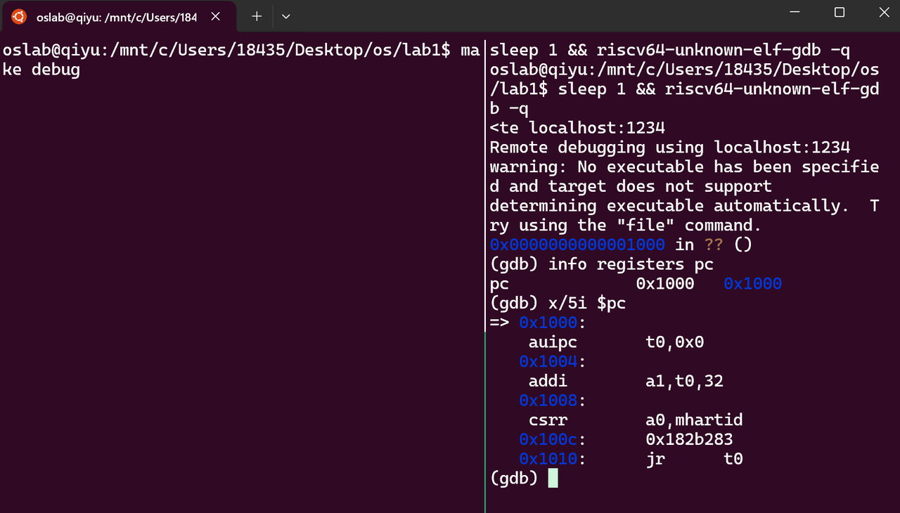

# 分工

1. 郭家琪同学主要负责练习一的回答和练习二的初步整理。

2. 盛亦欣同学主要负责练习二的完善和最终实验报告的撰写。

3. 我们共同研究讨论了两个练习并整理了知识点，各自分别搭建了实验环境，实现了具体操作。

# 知识点

> 列出你认为本实验中重要的知识点，以及与对应的OS原理中的知识点，并简要说明你对二者的含义，关系，差异等方面的理解（也可能出现实验中的知识点没有对应的原理知识点）。

## 1. 名词解释

1. riscv：risc是精简指令集，riscv是新兴的指令集。

2. qemu：模拟器，可以模拟一台 64 位 RISC-V 计算机。

3. GDB：调试工具。

4. OpenSBI固件：进行主初始化。CPU 的第一条指令从这里开始。

5. Bootloader：boot意为开机，这是一个专门负责开机“boot”、并把二三十G的操作系统从硬盘中加载“load”到内存中的程序。这是一个抽象的名字，比如本实验中就是QEMU自带的bootloader是OpenSBI固件。不同操作系统可能具有不同的bootloader。

## 2. 启动流程总览

最小可执行内核的完整启动流程为:

```plain&#x20;text
加电复位 → CPU从0x1000进入MROM → 跳转到0x80000000(OpenSBI) → OpenSBI初始化并加载内核到0x80200000 → 跳转到ent
```

1. 第一步是**硬件初始化和固件启动**。QEMU 模拟器启动后，会模拟加电复位过程。此时 PC 被硬件强制设置为固定的复位地址`0x1000`，从这里开始执行一小段写死的固件代码（MROM，Machine ROM）。MROM 的功能非常有限，主要是完成最基本的环境准备，并将控制权交给OpenSBI。OpenSBI 被加载到物理内存的`0x80000000`处。

2. 第二步是**OpenSBI 初始化与内核加载**。CPU 跳转到`0x80000000`处继续运行。OpenSBI 运行在 RISC-V 的最高特权级（M 模式），负责初始化处理器的运行环境。完成这些初始化工作后，OpenSBI 才会准备开始加载并启动操作系统内核。OpenSBI 将编译生成的内核镜像文件加载到物理内存的`0x80200000`地址处。以使用`watch *0x80200000`观察内核加载瞬间，避免单步跟踪大量代码。

3. 第三步是**内核启动执行**。OpenSBI 完成相关工作后，跳转到`0x80200000`地址，开始执行`kern/init/entry.S`。在`0x80200000`这个地址上存放的是`kern/init/entry.S`文件编译后的机器码，这是因为链接脚本将`entry.S`中的代码段放在内核镜像的最开始位置。`entry.S`设置内核栈指针，为C语言函数调用分配栈空间，准备C语言运行环境，然后按照RISC-V的调用约定跳转到`kern_init()`函数。最后，`kern_init()`调用`cprintf()`输出一行信息，表示内核启动成功。

## 3. 文件结构

1. 内核启动相关文件

`kern/init/entry.S`: OpenSBI启动之后将要跳转到的一段汇编代码。在这里进行内核栈的分配，然后转入C语言编写的内核初始化函数。

`kern/init/init.c`： C语言编写的内核入口点。主要包含`kern_init()`函数，从`kern/init/entry.S`跳转过来完成其他初始化工作。

* 编译、链接相关文件

`tools/kernel.ld`: ucore的链接脚本(link script), 告诉链接器如何将目标文件的section组合为可执行文件，并指定内核加载地址为0x80200000。

`tools/function.mk`: 定义Makefile中使用的一些函数

`Makefile`: GNU make编译脚本

* 其他文件

项目中还包括基础库（`libs`）、设备驱动（`kern/drive`）、内存管理(`kern/mm`)、异常处理（`kern/trap`）等文件，这些文件的相关内容将在后续实验中进行完善和具体讲解。

## 4. 其它知识

### 4.1 RISCV有四种**特权级（privilege level）**。

粗略的分类：


U-mode是用户程序、应用程序的特权级，S-mode是操作系统内核的特权级，M-mode是固件的特权级。

### 4.2 链接脚本 + 入口符号 → 可执行文件布局 & 程序头

* 实验现象
  `tools/kernel.ld` 规定 `. = 0x80200000;` 并把 `*(.text.kern_entry)` 放在最前；`entry.S` 里 `kern_entry:` 被 `.globl` 导出。

* 对应原理

操作系统课程中的“ELF 程序头”“段布局”“起始地址”概念：链接器按脚本把段排到指定物理地址，并记录入口符号。

***

### 4.3 复位向量 → 硬件复位向量（Reset Vector）

* 实验现象：`make debug` 后 `info reg pc` 得到 `pc=0x1000`，第一条指令固定为 `auipc t0,0x0`。

* 对应原理： RISC-V 规范规定：上电后 PC 被硬件置为“复位向量”，QEMU 实现为 0x1000。

***

### 4.4 SBI 调用 3→ 系统调用/特权级切换

* 实验现象
  `sbi_console_putchar` 里执行 `ecall`，CPU 从 S 模式陷到 M 模式，OpenSBI 帮你写串口寄存器。

* 对应原理
  “系统调用”通用模型：用户态→内核态；此处是内核态→机器态的固件调用。等价于 x86 的 `int 0x10`（BIOS 写屏）。

  含义/关系/差异

  * 实验里 手动内联汇编 填寄存器+`ecall`；Linux 用 `swapgs`/`syscall` 进内核，但都遵循“编号+参数+陷阱指令” 三步。

  * 差异：SBI 调用返回后仍在内核地址空间，只是特权级短暂提升；普通系统调用会切换页表、栈，隔离性更强。

***

### 4.5 答辩后补充：makefile

```c
target ... : prerequisites ...
    command
    ...
    ...
```

target：目标文件/object file/执行文件/标签（label）；

prerequisites：要生成那个target，所需要的文件或是目标，若没有满足要求，make之后会报错；

command：make需要执行的命令，可以是连续的多个

### 4.6 答辩后补充：stdio.c中打印启动页面的函数

```c
int cprintf(const char *fmt, ...) {
    va_list ap;
    int cnt;
    va_start(ap, fmt);
    cnt = vcprintf(fmt, ap);
    va_end(ap);
    return cnt;
}
```

在 C 语言中，函数定义中的 `...` 表示**可变参数列表**，用于声明一个可以接受数量不确定的参数的函数。

* `int cprintf(const char *fmt, ...)` 声明 `cprintf` 函数第一个参数是格式字符串 `fmt`，而 `...` 表示后面可以跟任意数量、任意类型的参数（类似 `printf` 函数的用法）

* 这种机制允许函数像 `printf` 一样处理可变数量的参数，

> 实现原理是通过 C 标准库的可变参数宏（`va_list`、`va_start`、`va_end`）来处理这些参数：
>
> 1. `va_list ap`：声明一个变量来存储参数列表
>
> 2. `va_start(ap, fmt)`：初始化参数列表，从 `fmt` 后面的参数开始
>
> 3. `vcprintf(fmt, ap)`：将参数列表传递给实际处理打印的函数（`vcprintf` 是处理可变参数的版本）
>
> 4. `va_end(ap)`：清理参数列表
>
> 在 QEMU 模拟的操作系统内核中，这种设计非常常见，因为内核打印函数需要像标准库 `printf` 一样灵活，能够处理不同数量和类型的参数（如打印数值、字符串等信息），所以使用 `...` 来支持可变参数是合理且必要的。

# 练习一

```c
#include <mmu.h>
#include <memlayout.h>

    .section .text,"ax",%progbits
    .globl kern_entry
kern_entry:
    la sp, bootstacktop

    tail kern_init

.section .data
    # .align 2^12
    .align PGSHIFT
    .global bootstack
bootstack:
    .space KSTACKSIZE
    .global bootstacktop
bootstacktop:
```

上面操作系统启动时的一段重要汇编代码kern/init/entry.S，在时间顺序（更准确地说，是CPU 的执行流程顺序）上紧接着“OpenSBI跳转到0x80200000地址”，隶属于启动流程的第三步，它做了两件核心的事：

1. 准备好**栈空间**。代码里专门划出了一块叫bootstack的内存区域（大小是KSTACKSIZE），然后把这块空间的顶端地址bootstacktop放到sp寄存器里，给接下来要运行的C语言程序提供运行的栈空间。

2. **交接工作**。用tail指令直接跳转到kern\_init函数，把控制权从汇编代码交给了C语言写的内核初始化程序。

整个过程是：先初始化栈，然后将控制权交给后续的C语言代码（跳转到kern\_init），完成了从底层启动到内核正式工作的过渡。

### 1. `la sp, bootstacktop`

#### ✅ 完成了什么操作？

* 将`bootstacktop`的地址加载到栈指针寄存器 `sp` 中。

* `bootstacktop`目前未定义，但是从名字上可以看出是“开机栈顶”的地址。

> - RISC-V 中`la`展开后通常是 `auipc` + `addi`，用于将绝对地址加载到寄存器。把 “开机栈顶”（也就是还没定义的 bootstacktop）这个地址，放入栈指针寄存器 sp 里。这里要用到 la 这个伪指令，它实际是拆成 auipc 和 addi 两条指令来干活的，目的是把这个绝对地址准确读到 sp 里。
>
> - RISC-V 中`sp` 是栈指针寄存器。是函数调用、局部变量、上下文保存等的基础。
>
> - `bootstacktop` 是 `.bss` 或 `.data` 中预留的一段内核栈空间的顶部地址（栈从高地址向低地址增长）。

#### ✅ 目的是什么？

* 初始化内核栈指针，为 C 语言运行做准备。

* 这一步之后，内核才能安全地调用 C 函数（如 `kern_init`），因为 C 编译器假设栈已初始化。

***

### 2. `tail kern_init`

#### ✅ 完成了什么操作？

* 跳转到 `kern_init` 函数执行，不返回。

* `tail` 是 RISC-V 的伪指令，等价于：

```assembly&#x20;language
jal x0, kern_init
```

* 即：跳转到 `kern_init`，但不保存返回地址（`ra` 不变），表示不会返回。

#### ✅ 目的是什么？

* 实现把控制权交给内核的 C 语言入口函数 kern\_init。这是从汇编启动代码转到 C 内核主逻辑的关键一步。

> 为啥用 tail 而不是 call 呢？因为 kern\_init 作为内核的主初始化函数，一旦运行就不会返回了（内核启动后会进入调度或者空闲循环），所以用 tail 更合适，相当于jal。

在 `kern/init/init.c` 中，`kern_init` 函数肩负着内核初启的核心任务：

1. 初始化内核环境：例如，清理 `.bss` 段，为未初始化的全局变量赋零值。

2. 向用户提供可视化反馈：这是操作系统与开发者/用户的第一次交互，通过输出信息告诉我们系统正在加载：“os is loading ...”。

**答辩后补充：jal和j的区别：jal全称为jump and link，与单纯jump的区别在于--跳转前是否会将当前指令的下一条指令地址（返回地址）保存到 `$ra`（返回地址寄存器）中。**


# 练习二

## 实验配置


1. 环境配置：Ubuntu-22.04 (WSL)、安装预编译工具链（配置gcc）、qemu模拟器。

2. **运行ucore测试：**&#x5728;源代码的根目录下`make qemu`

   

3. GDB调试工具测试。同时看两个终端窗口

   ```bash
   cd /mnt/c/Users/18435/Desktop/os/lab1
   export PATH=/opt/riscv/bin:$PATH
   tmux new -s debug -d 
   tmux splitw -h 
   tmux send-keys -t debug:0.0 'make debug' C-m  
   tmux send-keys -t debug:0.1 'sleep 1 && make gdb' C-m 
   tmux attach -t debug  

   tmux kill-session -t debug#退出
   ```

   

   

## 操作过程

### 一、执行初始化固件（OpenSBI）的汇编代码：

左边`make debug`。让虚拟`CPU`一启动就立刻暂停，打开本机端口，准备接受`GDB`的连接。右边`make gdb`。加载编译的后内核文件，连接本机端口。



操作：

1. 使用 `i r pc` 命令查看程序计数器（PC）的值，发现其初始值为 `0x1000`

\--> PC 初值=0x1000，这与 RISC-V 架构 “上电后程序从 `0x1000` 地址开始执行” 的规范相契合，此地址正是 OpenSBI（RISC-V 平台固件）的起始地址。从这里开始执行OpenSBI固件的汇编代码。

* 通过 `x/5i $pc` 命令查看从 `0x1000` 地址开始的 5 条指令，其中第一条指令为 `auipc t0, 0x0`

\--> 固件起始指令为 `auipc t0,0x0`，用于计算运行时地址。


* 这里单步执行的时候 pc地址正常变动到0x1004，说明代码正常执行，但是无返回代码指令，说明此时执行的是编码在OpenSBI固件上的指令。


#### **五条指令解释：**

1. `auipc t0, 0x0`

   1. 二进制语义：
      `t0 = PC + (imm20 << 12)`
      这里 imm20=0，所以 `t0 = 0x1000 + 0 = 0x1000`

   2. 启动作用：
      把“当前 PC 的 20 位以上部分”抓出来，作为后续“相对当前地址计算”的基址。
      因为 RISC-V 的绝对地址需要 `auipc + addi` 两条指令拼 32 位，这条先放高 20 位。

2. `addi a1, t0, 32`

   1. 二进制语义：`a1 = t0 + 32 = 0x1000 + 32 = 0x1020`

   2. 启动作用：
      计算 异常/陷阱向量表（mtvec） 的入口地址，准备写 CSR。
      0x1020 恰好是 OpenSBI 链接时安排的 `.trap` 段位置，后面会赋给 `mtvec`。

3) `csrr a0, mhartid`

   1. 二进制语义：
      `a0 = CSR mhartid`
      读出“硬件线程 ID”（HART ID），单核系统里恒为 0。

   2. 启动作用：
      固件需要知道自己在哪个核上跑，以便以后做核间同步或决定主核。
      对 QEMU virt 平台，这里只是保存现场，为 C 代码传参。

4) `0x182b283`

   1. 这是 压缩指令（16-bit） 的机器码，拆开后对应：
      `csrwi mtvec, 0x1`
      即：
      `mtvec = a1 & ~0x3`   （低 2 位清 0，表示向量模式 = 直接模式）

   2. 启动作用：
      把第 2 步算好的 0x1020 写进 机器模式陷阱向量寄存器 mtvec。
      以后任何异常/中断都会跳到 0x1020 处执行。

5. `jr t0`

   1. 二进制语义：
      `PC = t0`  （无条件寄存器跳转）

   2. 启动作用：
      跳回 0x1000 继续执行，但 PC 现在已更新，下一条指令就是 0x1004 处的 第二条指令（即继续后续初始化）。
      这里利用 `jr` 完成 相对当前地址的继续运行，也常用于 位置无关代码（PIC）。

### 二、SBI 跳转到 0x80200000，将控制权移交内核

对`kern_entry`函数下断点（`b`是`break`的缩写）：

```plain&#x20;text
(gdb) b* kern_entry
```


此时内核暂停在入口函数的第一条汇编指令处，我们可以检查寄存器状态以及反汇编附近的代码。


操作：

1. 确认当前 PC`(gdb) i r pc`

   返回`pc   0x80200000   0x80200000 <kern_entry>`

   \--> 物理地址确实落在 0x8020\_0000，与链接脚本 `kernel.ld` 里 `BASE_ADDRESS = 0x80200000` 吻合

2. 查看指令流：`(gdb) x/3i $pc`

   输出：

   ```plain&#x20;text
   (gdb) x/3i $pc
      0x80200000 <kern_entry>:     auipc   sp,0x3
      0x80200004 <kern_entry+4>:   mv      sp,sp
      0x80200008 <kern_entry+8>:   j       0x8020000a <kern_init>
   ```

   `la sp, bootstacktop` 是 伪指令，被汇编器展开成两条真实指令：

   `第三条 j 0x8020000a` 直接 跳转到 C 函数 kern\_init()，不会返回

3. 单步一条`(gdb) si`

   返回对应代码，说明 内核代码正在执行。

   ```plain&#x20;text
   (gdb) si
   0x0000000080200004 in kern_entry () at kern/init/entry.S:7
   7         la sp, bootstacktop
   ```

   只执行了 一条指令（`auipc` 已完成）

   PC 现在 0x80200004，即处在伪指令的第二条

***


#### 遇到问题：


从interrupt输出的终止行能看出程序越过了breakpoint，执行了后面的步骤


左quit, c to continue without paging--Quit

重新执行 一上来不要c，直接换行，这次成功


### 三、**内核启动执行：`kern_init()`调用`cprintf()`输出，内核启动成功。**


