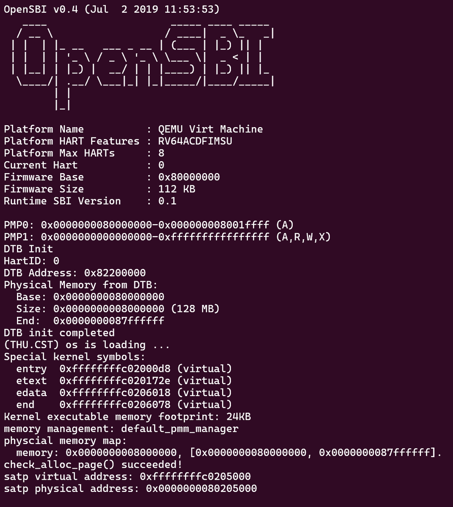
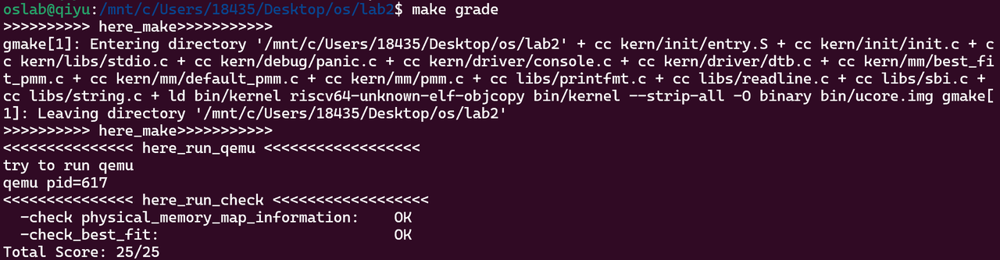
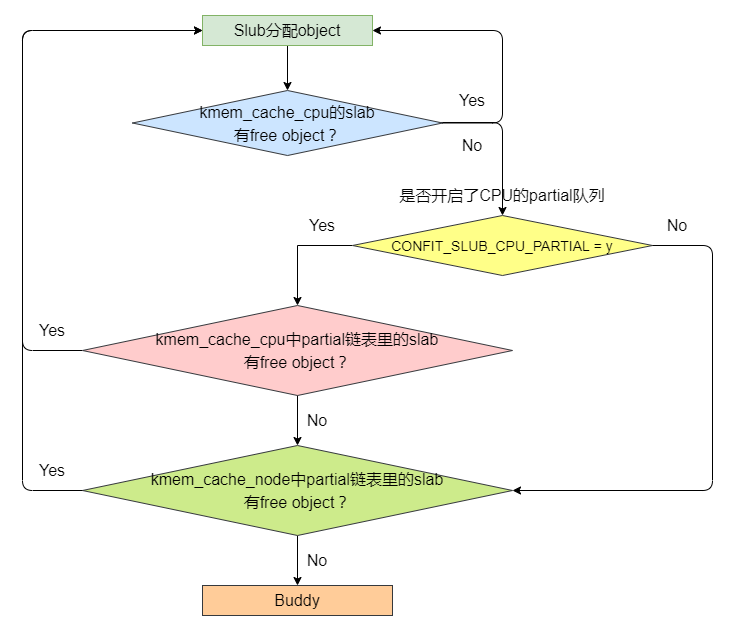
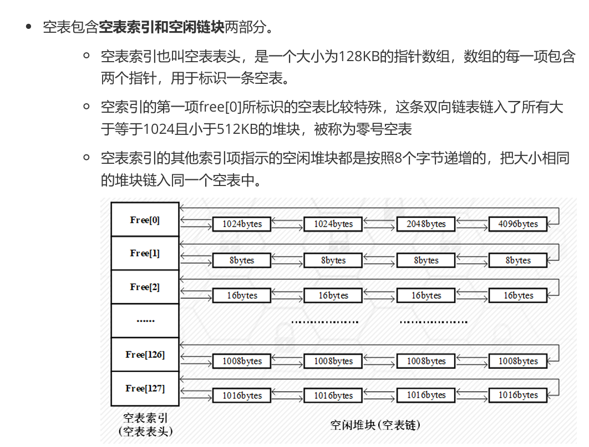

# 前置知识

**最直接的内存访问：**&#x7A0B;序指令中的内存地址会直接被CPU当作物理地址发送到内存总线上。这种内存管理方式对内存连续性有要求，每个程序都需要获得连续的内存空间才能运行，所以物理内存会产生碎片化问题，难以在复杂系统中有效工作。且多个程序需要共享内存控件时，会产生冲突。

**翻译机制：**&#x865A;拟地址需要经过一部翻译才能编程真正的物理地址，这个用来翻译的“词典”可以用页表来表示，里面有虚拟页号到实际内存的物理页号的对应关系。

**分页机制的优点：**&#x7075;活管理地址，程序员只需要面对一个连续的虚拟地址空间，而不需要关心底层物理内存是否连续。相同虚拟地址可以映射到不同的物理地址。os还可以通过修改页表，方便实现内存共享、隔离和换页。

**RISCV的`sv39`页表机制：**&#x7269;理地址(Physical Address)有 56位，而虚拟地址(Virtual Address) 有 39位。实际使用的时候，一个虚拟地址要占用 64位，只有低 39位有效，我们规定 63−39 位的值必须等于第 38 位的值（大家可以将它类比为有符号整数），否则会认为该虚拟地址不合法。最后12位表示页内偏移。除了最后12位，前面的部分表示的是物理页号或者虚拟页号。

* 0-11位表示页内偏移

* 12-38位表示物理页号

* 39-63位必须等于第 38 位（规定）

## 描述程序在进行物理内存分配的过程

### 分页机制设计思路

#### entry.S

主要任务是**设置虚拟内存管理**，将三级页表的物理地址和Sv39模式位写入**satp寄存器**，以**建立内核的虚拟内存空间**，为之后建立分页机制的过程做一个准备。将 `SP` 寄存器从原先指向OpenSBI 某处的栈空间，改为指向我们自己在内核的内存空间里分配的栈；同时需要跳转到函数 `kern_init` 中。

1. 对比于实验一的代码改进：

   1. 实验一中的内核链接地址是物理地址`0x80200000`**CPU 刚上电时运行在 Bare 模式**（MMU 关闭），把地址当物理地址用，正好能直接访问到这些位置，一切正常。

   2. 现在的链接地址改成了高虚拟地址`0xffffffffc0200000`，但是MMU没开，bare模式的cpu不执行虚拟到物理的翻译，会被当成物理地址访问。而物理地址没有那么多位，于是构建一个合适的页表。实现 **`va` 到 `pa` 的映射**。

      * `bootstacktop` ≈ `0xffffffff_c020f000`

      * `kern_init`  ≈ `0xffffffff_c0201234`

   3. 只需要**分配一页内存用来存放三级页表**，并将其**最后一个页表项**进行适当设置即可。

2. 进入虚拟内存访问方式步骤

   1. 分配页表内存并填好页表项

      静态完成，直接“写死”在二进制里。只填了最后一项（索引 511），把
      虚拟地址 `0xffff_ffff_c000_0000` → 物理地址 `0x8000_0000`（1 GB 大页）。

   2. 把页表物理地址写进stap寄存器（MMU（内存管理单元）的“根目录”寄存器）

      RISC-V 要求 SATP 里放的是物理页号（PPN），所以要手工“减掉偏移、右移 12 位”。所有 取指、取数，都先经过这张表翻译

   3. 刷新TLB

      把刚才可能已缓存的“物理→物理”旧条目清掉，避免幽灵地址。

   4. 跳转到kern\_init函数的虚拟地址

### 实现物理内存管理

* 检查当前还有多少空闲的物理页，返回空闲的物理页数目

* 给出n，尝试分配n个物理页，可以返回一个起始地址和连续的物理页数目，也可能分配一些零散的物理页，返回一个连起来的链表。

* 给出起始地址和n，释放n个连续的物理页

#### kern\_init()

此函数新增一个接口`pmm_init()`主要用来负责初始化物理内存管理。先选好算法，再把整片物理内存切成 4 KiB 小页并建好元数据，接着把空闲页串成算法链表，最后测试。

```c
pmm_manager = &best_fit_pmm_manager;//挑一个算法当经理 指向算法实例
pmm_manager->init();
```

**问 DTB（设备树）内存开始和可用内存size大小&#x20;**→ 算 npage（总共有多少物理页）→ 留好内核/页数据库空间 → 其余全部挂进空闲链表&#x20;

```c
//问DTB 板子有多少内存
uint64_t mem_begin = get_memory_base();  // 0x8000_0000 开始位置
uint64_t mem_size  = get_memory_size();  // 比如 128 MB 大小
uint64_t mem_end   = mem_begin + mem_size;

//算出页数 
npage = maxpa / PGSIZE;   // PGSIZE=4096

//定位“页数据库”本身放在哪
extern char end[];        // 链接脚本给出的内核 bss 结尾
pages = (struct Page *)ROUNDUP((void *)end, PGSIZE);

//留好内核/页数据库空间，把所有页标为“保留”——防止误用
for (i = 0; i < npage - nbase; i++)
    SetPageReserved(pages + i);
    
//计算真正空闲的区域
uintptr_t freemem = PADDR(pages + sizeof(struct Page)*(npage-nbase));
freemem = ROUNDUP(freemem, PGSIZE);
mem_end = ROUNDDOWN(mem_end, PGSIZE);

//把空闲页交给算法链表
init_memmap(pa2page(mem_begin), (mem_end - freemem) / PGSIZE);
```

alloc/free 一遍，保证链表正确。打印 SATP 根页表地址用于调试。

```c
pmm_manager->check();

satp_virtual = (pte_t*)boot_page_table_sv39;
satp_physical = PADDR(satp_virtual);
cprintf("satp virtual address: 0x%016lx\nsatp physical address: 0x%016lx\n",
        satp_virtual, satp_physical);
```

#### 数据结构-双向链表存储

1. `list_entry`链表节点，链表操作使用`page_link`字段。

2. 只有`list_entry *le`的地址怎么拿到整页Page的地址：减去固定偏移量，专门给 Page 做的快捷宏一行代码就从链表节点跳回完整页描述符。

3. 内存vs外设：RISC-V把外设寄存器也映射到物理地址空间的某一段，CPU 压根分不清，统一用 `load/store` 指令访问，这就是 Memory-Mapped I/O（MMIO）。

#### 物理内存-->物理地址

一般是由 bootloader ，即 OpenSBI 来完成的。完成对于包括物理内存在内的各外设的扫描，将扫描结果以 DTB(Device Tree Blob) 的格式保存在物理内存中的某个地方。随后 OpenSBI 会将其地址保存在 `a1` 寄存器中，给我们使用。

| 区域                           | 用途          | 状态       |
| ---------------------------- | ----------- | -------- |
| `[0x8000_0000, 0x8020_0000)` | OpenSBI 固件  | **永久保留** |
| `[0x8020_0000, end)`         | 内核代码/数据/bss | **永久保留** |
| `[end, pages 数组结尾)`          | Page 结构体本身  | **永久保留** |

除了上述表格，剩下 `[pages_end, 0x8800_0000)` 才是真正可分配的 DRAM。

记录哪页空闲：

* **在内核末尾连续摆放 `struct Page pages[]` 数组，一一对应每一物理页。**

* 初始把所有页标为 `PG_reserved`（禁区），再把禁区外的那一段调 `init_memmap()` 清标志、挂进空闲链表。

# 练习一

## first-fit 连续物理内存分配算法

维护一个空闲的块列表，当需要内存时，我们就找到对应的一块内存最大的空闲块，分配给对应的进程。从空闲内存块的链表上查找第一个大小大于所需内存的块，分配出去，回收时会按照地址从小到大的顺序插入链表，并且合并与之相邻且连续的空闲内存块。

### 分析相关函数的作用

#### default\_init

初始化存放空闲块的链表

系统上电后，把`nr_free`和`free_list`清空

```c++
static free_area_t free_area;          /* 全局唯一空闲区描述符 */
#define free_list (free_area.free_list)/* 宏偷懒：后面直接写 free_list 即可 */
#define nr_free   (free_area.nr_free)  /* 宏偷懒：当前空闲页总数 */

static void
default_init(void)
{
    list_init(&free_list);             /* 1. 把双向循环链表头结点指针指向自己 */
    nr_free = 0;                       /* 2. 空闲页计数器清零 */
}

//list_init函数定义
static inline void
list_init(list_entry_t*elm){
    elm->prev=elm->next=elm;
}
```

#### default\_init\_memmap

`base` 是这段内存首页的`struct Page` 指针，`n` 是页数。

```c++
static void
default_init_memmap(struct Page *base, size_t n)
{
    assert(n > 0);                     /* 0. 判定n是都大于0，确定需要存放的页面是否不为0，若为0就不需要存放*/
    struct Page *p = base;//定义指针p，类型是指向Page结构体的指针，并初始化为只想base指向的内存地址
    for (; p != base + n; p++) {       /* 1. 把 n 页全部“格式化” */
        assert(PageReserved(p));       /* 1.1 进来前必须是保留页（boot 阶段已标）*/
        p->flags = p->property = 0;    /* 1.2 清标志、清属性 初始化为0*/
        set_page_ref(p, 0);            /* 1.3 引用计数归零 */
    }
    base->property = n;                /* 2. 首页记录“本块共 n 页” 块总数 */
    SetPageProperty(base);             /* 2.1 打标签：我是空闲块头 */

    nr_free += n;                      /* 3. 更新 n 页 */

    /* 4. 按物理地址升序插到 free_list 里（First-Fit 要求地址有序） */
    if (list_empty(&free_list)) {      /* 4.1 空链表直接挂 将其实页面的链表节点添加到链表中*/
        list_add(&free_list, &(base->page_link));
    } else {
        list_entry_t *le = &free_list; /* 4.2 从头找第一个“比我大”的块 初始化一个指针指向空闲链表头*/
        while ((le = list_next(le)) != &free_list) {
            struct Page *page = le2page(le, page_link);
            if (base < page) {         /* 地址比较决定顺序 如果新页面的起始地址base小于当前遍历到的页面page的地址，说明找到了合适的插入位置*/
                list_add_before(le, &(base->page_link));
                break;
            } else if (list_next(le) == &free_list) { /* 已经到尾 */
                list_add(le, &(base->page_link));
                //如果不是就在后面链接
            }
        }
    }
}
```

把一段连续物理页从保留状态编程可用状态，并按地址顺序插进全局空闲链表，保证后面First-Fit扫描时从低地址到高地址。

#### default\_alloc\_pages

**核心：**&#x627E;到第一块大内存。如果剩余空闲内存块大小多于所需的内存区块大小，则从链表中查找大小超过所需大小的页，并更新该页剩余的大小。

```c
static struct Page *
default_alloc_pages(size_t n)
{
    assert(n > 0);
    if (n > nr_free)                   /* 0. 仓库总量都不够，直接失败 */
        return NULL;

    struct Page *page = NULL;
    list_entry_t *le = &free_list;
    /* 1. 线性扫描：从低地址往高找第一个 property >= n 的块 */
    while ((le = list_next(le)) != &free_list) {
        struct Page *p = le2page(le, page_link);
        if (p->property >= n) {        /* 1.1 找到了 */
            page = p;
            break;
        }
    }
    if (page == NULL)                  /* 1.2 没有合适块 */
        return NULL;

    /* 2. 把整块从链表摘掉 */
    list_entry_t *prev = list_prev(&(page->page_link));
    list_del(&(page->page_link));

    /* 3. 如果块比需求大，把剩余部分劈出去重新挂回链表 */
    if (page->property > n) {
        struct Page *p = page + n;     /* p 指向剩余首页 */
        p->property = page->property - n;
        SetPageProperty(p);            /* 标记新块头 */
        list_add(prev, &(p->page_link)); /* 插回原位置（地址有序） */
    }

    nr_free -= n;                      /* 4. 账本减掉 n 页 */
    ClearPageProperty(page);           /* 5. 我不再是空闲块头 */
    return page;                       /* 6. 返回分配出去的首页 */
}
```

从低地址开始扫描，看到第一块内存比需求大就取n页，剩下的重新挂回链表，保证链表仍然有序。

#### default\_free\_pages

该函数用于释放内存块，从起始页`base`退回n页。

```c++
static void
default_free_pages(struct Page *base, size_t n)
{
    assert(n > 0);
    struct Page *p = base;
    /* 0. 把待回收的 n 页全部清标志、清引用 */
    for (; p != base + n; p++) {
        assert(!PageReserved(p) && !PageProperty(p));
        p->flags = 0;
        set_page_ref(p, 0);
    }
    base->property = n;                /* 1. 首页记录“我这块有 n 页” */
    SetPageProperty(base);             /* 1.1 标记我是空闲块头 */
    nr_free += n;                      /* 2. 账本加回 n 页 */

    /* 3. 按地址升序插回 free_list（与 init_memmap 完全相同） */
    if (list_empty(&free_list)) {
        list_add(&free_list, &(base->page_link));
    } else {
        list_entry_t *le = &free_list;
        while ((le = list_next(le)) != &free_list) {
            struct Page *page = le2page(le, page_link);
            if (base < page) {
                list_add_before(le, &(base->page_link));
                break;
            } else if (list_next(le) == &free_list) {
                list_add(le, &(base->page_link));
            }
        }
    }

    /* 4. 向前合并：看前一个块是否刚好挨着我 */
    le = list_prev(&(base->page_link));
    if (le != &free_list) {
        p = le2page(le, page_link);
        if (p + p->property == base) { /* 地址连续 */
            p->property += base->property; /* 把长度累加到前块 */
            ClearPageProperty(base);   /* 我不再是块头 */
            list_del(&(base->page_link)); /* 把自己从链表摘掉 */
            base = p;                  /* 当前块指针上移 */
        }
    }

    /* 5. 向后合并：看当前块是否刚好连着后一块 */
    le = list_next(&(base->page_link));
    if (le != &free_list) {
        p = le2page(le, page_link);
        if (base + base->property == p) { /* 地址连续 */
            base->property += p->property; /* 长度累加 */
            ClearPageProperty(p);        /* 后块不再是头 */
            list_del(&(p->page_link));   /* 把后块摘掉 */
        }
    }
}
```

把退回来的页按照地址插回链表，再检查左右邻居是否空闲且地址连续，若空闲就将它们合并成一块更大的空闲块，缓解外部碎片。


#### default\_nr\_free\_pages

用于获取当前的空闲页面的数量。

```c
static size_t
default_nr_free_pages(void) {
    return nr_free;
}
```

#### basic\_check

最小化的冒烟测试，快速验证内存分配器的基本功能有没有被写崩。

```c++
static void
basic_check(void)
{
    /*---- 准备三个空指针，用来接即将领到的页 ----*/
    struct Page *p0, *p1, *p2;
    p0 = p1 = p2 = NULL;

    /*---- 场景 1：连领 3 页，必须都成功 ----*/
    assert((p0 = alloc_page()) != NULL);   // 领第 1 页
    assert((p1 = alloc_page()) != NULL);   // 领第 2 页
    assert((p2 = alloc_page()) != NULL);   // 领第 3 页

    /* 保证 3 页互不重复，防止分配器给同一张纸两次 */
    assert(p0 != p1 && p0 != p2 && p1 != p2);

    /* 刚出炉的页引用计数必须是 0，还没被人用过 */
    assert(page_ref(p0) == 0 && page_ref(p1) == 0 && page_ref(p2) == 0);

    /* 转换出的物理地址必须落在真实内存范围，防止越界 */
    assert(page2pa(p0) < npage * PGSIZE);
    assert(page2pa(p1) < npage * PGSIZE);
    assert(page2pa(p2) < npage * PGSIZE);

    /*---- 场景 2：人工造“空仓” ----*/
    list_entry_t free_list_store = free_list;  // 备份真正的空闲链表头
    list_init(&free_list);                     // 把链表清空，假装没货
    assert(list_empty(&free_list));            // 确认链表确实空了

    unsigned int nr_free_store = nr_free;      // 备份真实剩余页数
    nr_free = 0;                               // 账本也清零

    assert(alloc_page() == NULL);              // 空仓时必须领不到页

    /*---- 场景 3：退 3 页再领 3 页，看账本对不对 ----*/
    free_page(p0);                             // 退第 1 页
    free_page(p1);                             // 退第 2 页
    free_page(p2);                             // 退第 3 页
    assert(nr_free == 3);                      // 账本应该立刻显示 3 页

    assert((p0 = alloc_page()) != NULL);       // 再领 1 页
    assert((p1 = alloc_page()) != NULL);       // 再领 1 页
    assert((p2 = alloc_page()) != NULL);       // 再领 1 页
    assert(alloc_page() == NULL);              // 领光了，再领必须失败

    /*---- 场景 4：只退 1 页，再领必须拿到同一页（LIFO 顺序） ----*/
    free_page(p0);                             // 只退最后一页
    assert(!list_empty(&free_list));           // 链表不该空

    struct Page *p;
    assert((p = alloc_page()) == p0);          // 必须拿回刚才那一页
    assert(alloc_page() == NULL);              // 又空了，再领失败

    assert(nr_free == 0);                      // 账本归零

    /*---- 场景 5：恢复现场，不影响后续测试 ----*/
    free_list = free_list_store;               // 链表头还原
    nr_free = nr_free_store;                   // 账本还原

    free_page(p);                              // 把测试用页全部退回去
    free_page(p1);
    free_page(p2);
}
```

#### default\_check

把分配器推到各种极端角落，只要任何一条assert炸掉，说明代码有隐藏bug

```c++
static void
default_check(void)
{
    /*==================== 剧情 0：仓库大盘点 ====================*/
    int count = 0, total = 0;
    list_entry_t *le = &free_list;

    /* 遍历整条空闲链表，数块数、数总页数，必须跟 nr_free 对账 */
    while ((le = list_next(le)) != &free_list) {
        struct Page *p = le2page(le, page_link);
        assert(PageProperty(p));        // 每块头必须贴“空闲块”标签
        count++, total += p->property;  // 累加块数 和 总页数
    }
    assert(total == nr_free_pages());   // 账本必须一致，否则爆炸


    /*==================== 剧情 1：跑基本心跳测试 ====================*/
    basic_check();                      // 领 3 张→退 3 张→空仓→再领光


    /*==================== 剧情 2：一次性领 5 页大块 ====================*/
    struct Page *p0 = alloc_pages(5), *p1, *p2;
    assert(p0 != NULL);                 // 必须给得出 5 页
    assert(!PageProperty(p0));          // 返回首页不能再贴“空闲头”


    /*==================== 剧情 3：人工造“空仓” ====================*/
    list_entry_t free_list_store = free_list; // 备份真实链表头
    list_init(&free_list);                    // 清空链表，假装没货
    assert(list_empty(&free_list));           // 确认链表空
    assert(alloc_page() == NULL);             // 空仓时必须领不到

    unsigned int nr_free_store = nr_free;     // 备份真实账本
    nr_free = 0;                              // 账本也清零


    /*==================== 剧情 4：部分退货——只退中间 3 页 ====================*/
    free_pages(p0 + 2, 3);                    // 退 [p0+2, p0+4] 共 3 页
    assert(alloc_pages(4) == NULL);           // 要 4 页必须失败（只有 3 页碎片）
    assert(PageProperty(p0 + 2) && p0[2].property == 3); // 新块头必须正确


    /*==================== 剧情 5：领走刚退的 3 页 ====================*/
    assert((p1 = alloc_pages(3)) != NULL);    // 必须拿到刚才那 3 页
    assert(alloc_page() == NULL);             // 领光后再领 1 页失败
    assert(p0 + 2 == p1);                     // 地址必须完全一致


    /*==================== 剧情 6：零散退，测合并边界 ====================*/
    p2 = p0 + 1;                              // p2 指向第 2 页（仍占用）
    free_page(p0);                            // 退第 1 页（单页块）
    free_pages(p1, 3);                        // 再退第 3~5 页（3 页块）

    /* 此时第 1 页和第 3~5 页空闲，中间第 2 页仍占用，不能合并 */
    assert(PageProperty(p0) && p0->property == 1); // 第 1 页独立块
    assert(PageProperty(p1) && p1->property == 3); // 第 3~5 页独立块


    /*==================== 剧情 7：单页/双页零散领，看地址连续性 ====================*/
    assert((p0 = alloc_page()) == p2 - 1);    // 领 1 页，必须拿 p2 前面那页
    free_page(p0);                            // 再退掉
    assert((p0 = alloc_pages(2)) == p2 + 1);  // 领 2 页，必须拿 p2 后面相邻 2 页


    /*==================== 剧情 8：全部退回去，合并成 5 页大块 ====================*/
    free_pages(p0, 2);                        // 退 2 页
    free_page(p2);                            // 退中间第 2 页
    assert((p0 = alloc_pages(5)) != NULL);    // 现在可以一次性领回 5 页
    assert(alloc_page() == NULL);             // 仓库又空了


    /*==================== 剧情 9：恢复现场，再盘点一次 ====================*/
    assert(nr_free == 0);                     // 测试过程账本必须归零
    nr_free = nr_free_store;                  // 还原真实账本
    free_list = free_list_store;              // 还原真实链表

    free_pages(p0, 5);                        // 把最后 5 页退回去

    /* 再数一遍盒子，应该跟最初盘点数完全抵消 */
    le = &free_list;
    while ((le = list_next(le)) != &free_list) {
        struct Page *p = le2page(le, page_link);
        count--, total -= p->property;
    }
    assert(count == 0);   // 块数差为 0
    assert(total == 0);   // 总页数差为 0
}

/* 导出到 pmm_manager 表，让内核启动时自动调用 default_check() */
const struct pmm_manager default_pmm_manager = {
    .name = "default_pmm_manager",
    .init = default_init,
    .init_memmap = default_init_memmap,
    .alloc_pages = default_alloc_pages,
    .free_pages = default_free_pages,
    .nr_free_pages = default_nr_free_pages,
    .check = default_check,
};
```

### 改进空间

#### `default_alloc_pages` 里 `while ((le=list_next(le))!=&free_list)` 最坏要扫完全部空闲块

用Segregated Free List把把“单链表”拆成 11 条，分别挂 1、2、4、8、16、32、64、128、256、512、1024 页的块。

分配：⌈log₂ n⌉ 定位到一条链表，头拿即可；若空，向高一级链表拆块。

释放：插回原链表，同阶 buddy 合并

时间复杂度改进O(n) → O(1)，alloc 路径1 次链表头取出大大加速。

#### 减少外部碎片化

使用Buddy System把内存按 2^k 页对齐、拆分、合并；任何块都有唯一伙伴，合并 O(1)。

实现：把 `Page.property` 改存“阶数 k”，而不再存连续页数；`free_area` 里放 `MAX_ORDER=11` 条链表。

具体在challenge实现。

#### 合并开销

`default_free_pages` 里为了找前驱/后继连续块，必须沿链表线性对比地址，最坏再扫 8000 节点。

改进使得O(n) 前后查找 → O(1) 边界标签

在每页两端存“前后连续空闲长度”，释放时直接算术运算即可知道能否合并。内存代价较小可忽略。

# 练习2



ucore 部分打印的 entry/etext/edata/end 是内核各段在虚拟地址空间的位置；
“check\_alloc\_page() succeeded” 说明物理页分配器已就绪；
最后给出的 satp 值表示内核页表已生成，马上就要开 MMU、真正进入分页模式运行。

本实验基于 ucore 操作系统框架，实现了 Best-Fit（最佳适应）物理内存分配算法，替换原有的 First-Fit 算法。核心目标是：在空闲链表中查找最小的、满足请求大小的连续物理页块进行分配，以减少内存碎片。

关键函数实现：

| 函数名                              | 功能说明                                               |
| -------------------------------- | -------------------------------------------------- |
| `best_fit_init()`                | 初始化空闲链表和计数器                                        |
| `best_fit_init_memmap()`         | 将一段连续物理内存初始化为空闲页块，并按地址顺序插入链表                       |
| `best_fit_alloc_pages(size_t n)` | **Best-Fit 核心逻辑**：遍历链表，找到最小的满足 `>=n` 的页块，分配并分割剩余部分 |
| `best_fit_free_pages()`          | 释放页块，按地址顺序插入链表，并尝试与前后空闲块合并                         |
| `best_fit_nr_free_pages()`       | 返回当前空闲页总数                                          |

Best-Fit 只比 First-Fit 多了一次“全程扫描”+“比较大小”，就换来“更小但更多”的碎片。

```c
struct Page *page = NULL;
list_entry_t *le = &free_list;
size_t min_size = nr_free + 1;
/*LAB2 EXERCISE 2: YOUR CODE*/ 2311781
    // 下面的代码是first-fit的部分代码，请修改下面的代码改为best-fit
    // 遍历空闲链表，查找满足需求的空闲页框
    // 如果找到满足需求的页面，记录该页面以及当前找到的最小连续空闲页框数量

    while ((le = list_next(le)) != &free_list) {
        struct Page *p = le2page(le, page_link);
        if (p->property >= n && p->property < min_size) {
            page = p;
            min_size = p->property;
        }
    }
```

* 遍历整个空闲链表

* 找到最小且满足需求的页块

* 若页块大于需求，则分割剩余部分并重新插入链表

* 更新 `nr_free`，清除分配页的 `PG_property` 标志

```json
/*LAB2 EXERCISE 2: YOUR CODE*/ 
        // 编写代码
        // 1、判断前面的空闲页块是否与当前页块是连续的，如果是连续的，则将当前页块合并到前面的空闲页块中
        // 2、首先更新前一个空闲页块的大小，加上当前页块的大小
        // 3、清除当前页块的属性标记，表示不再是空闲页块
        // 4、从链表中删除当前页块
        // 5、将指针指向前一个空闲页块，以便继续检查合并后的连续空闲页块
        if (p + p->property == base) {
            p->property += base->property;
            ClearPageProperty(base);
            list_del(&(base->page_link));
            base = p;
        }
```

**释放与合并逻辑（`best_fit_free_pages`）**

1. 设置释放页块的 `property` 和 `PG_property` 标志

2. 按地址顺序插入链表

3. 向前合并：若前一页块地址连续，则合并

4. 向后合并：若后一页块地址连续，则合并

5. 更新链表和 `nr_free`

**测试成功通过**



**改进空间**

| 问题          | 改进方向                                                      |
| ----------- | --------------------------------------------------------- |
| **外部碎片**    | 引入 **slab allocator** 或 **buddy system** 对小页块进行缓存管理       |
| **遍历开销**    | 使用 **红黑树/最小堆** 按页块大小索引，减少查找时间复杂度从 O(n) 到 O(log n)         |
| **内存抖动**    | 引入 \*\*延迟合并\*\*（deferred coalescing），避免频繁合并与分割            |
| **分配偏向**    | 引入 \\\*\\\* segregated free list\\\*\\\*（分离链表），按大小分级管理空闲块 |
| **NUMA 感知** | 在多核系统中，考虑物理内存的局部性，优先分配本地 NUMA 节点内存                        |

# Challenge1 Buddy System

## 背景知识介绍
buddy system是一种经典的内存分配算法，应用于Linux底层内存管理。它将系统中的可用存储空间划分为存储块(Block)来进行管理, 每个存储块的大小必须是2的n次幂(Pow(2, n)), 即1, 2, 4, 8, 16, 32, 64, 128...

## 设计目标
- 实现初始化函数，配置系统中的初始内存块。

- 实现内存分配和释放的核心算法，并确保能处理不同大小的内存请求。在这个过程中也要实现内存块的合并与分裂操作。

- 编写合适的check函数来验证算法的正确性。

## 关键值界设置


    #define MAX_INIT_PAGES 16384  // 2^14 = 16384 
    int MEM_BEGIN;

由于buddy system要求每个块的大小是2的次方，首先打印出总的空闲页数量，发现为31929，向下取最大的2的次方的数，发现为2^14（16384），因此在文件开始部分进行定义。

MEM_BEGIN是定义初始块时base的首地址，它的作用和赋值将在后文进行介绍，此处不赘述。

## 函数编写
### 初始化空闲块链表
    static void
    buddy_system_init(void) {
        list_init(&free_list);
        nr_free = 0;
    }

此过程初始化空闲块链表（指定free_list的prev和next指针都指向它自身），并将初始空闲页数定义为0。

### 初始化内存管理
    static void
    buddy_system_init_memmap(struct Page *base, size_t n) {
        assert(n > 0);
        MEM_BEGIN = (size_t)base;//作用将在后文介绍
        n = MAX_INIT_PAGES; // 限制
        struct Page *p = base;
        for (; p != base + n; p ++) {
            assert(PageReserved(p));
            p->flags = p->property = 0;//设置它们引用次数为0且目前都可用
            set_page_ref(p, 0);
        }
        base->property = n;// 对第一页进行设置，整体是一个大块，记录页数多少
        SetPageProperty(base);
        nr_free += n;// 记录的空闲块个数+n
        if (list_empty(&free_list)) {
            list_add(&free_list, &(base->page_link));
        } else {
            list_entry_t* le = &free_list;
            while ((le = list_next(le)) != &free_list) {
                struct Page* page = le2page(le, page_link);
                if (base < page) {
                    list_add_before(le, &(base->page_link));
                    break;
                } else if (list_next(le) == &free_list) {
                    list_add(le, &(base->page_link));
                }
            }
        }
    }
其中(le = list_next(le)) != &free_list作为循环终止条件由于我们定义了此链表为双向循环链表。此外，增加顺序是依照内存顺序而不是依照块的大小。

此过程将指定页面数的内存块初始化为一个大的空闲块，并将其插入到 free_list 链表中，手动限制最大分配的页数为 16384 页。

### 内存分配
首先，在分配内存时，如果请求内存页数不是2的次方，应该将它处理成大于等于它的最小的2的次方数。因此编写函数如下：

    static size_t round_up_pow2(size_t n) {
        size_t size = 1;
        while (size < n) {
            size <<= 1;
        }
        return size;
    }
然后才是内存分配相关函数：

    static struct Page *
    buddy_system_alloc_pages(size_t n) {
        assert(n > 0);
        n = round_up_pow2(n);// 将请求的块大小调整为大于等于 n 的最小的 2 的幂次方
        // 如果请求的页数大于可用页数，返回 NULL
        if (n > nr_free) {
            return NULL;
        }
        struct Page *page = NULL;
        list_entry_t *le = &free_list;
        // 遍历空闲块链表，查找第一个块大小大于等于n的空闲块
        while ((le = list_next(le)) != &free_list) {
            struct Page *p = le2page(le, page_link);
            if (p->property >= n) {
                page = p;// 找到第一个块大小大于等于n的空闲块
                //然后打印一下起始地址。
                cprintf("找到第一个满足要求的空闲块 p\n");
                cprintf("准备用于分配的空闲块 p 的地址为: 0x%016lx.\n", p);
                cprintf("准备分配的空闲块 p 的页数为: %d\n", p->property);
                break;
            }
        }
        // 分裂空闲块->也就是变成开始的一半
        if (page != NULL) {
            cprintf("开始分裂空闲块……\n\n");
            list_entry_t* prev = list_prev(&(page->page_link));// 找到 page 前面的块
            list_del(&(page->page_link));// 从空闲块链表中移除空闲块 page
            // 持续分裂，直到获得大小相同的块
            while (page->property > n) {
                struct Page *p = page + (page->property >> 1);// 分裂当前空闲块成两个块
                p->property = page->property >> 1;// 设置 p 的大小为空闲块的一半
                SetPageProperty(p);// 标记 p 这个块为空闲块 
                list_add(prev, &(p->page_link));// 将 p 插入到空闲块链表中
                page->property >>= 1;// 将当前空闲块的大小减半
            }
            
            nr_free -= n;// 更新空闲页计数器
            ClearPageProperty(page);
        }
        cprintf("最终分配的空闲块 p 的页数为: %d\n", page->property);
        return page;
    }

此过程主要完成任务如下：

- 将输入的所需页面大小进行处理。处理后n如果超过最大可分配内存，则直接返回。

- 找到内存中第一个块大小>=n的块（此处采用了first_fit的策略，速度较快）。然后对此块进行分裂，将多余的页面作为新的空闲块重新插入到空闲块链表中，直到有块大小=n。

- 更新空闲页计数器，并调用 ClearPageProperty(page) ，表示此块已经进行分配。

### 内存释放
我开始的时候思考了是释放内存时候输入的n是向上取值还是向下取值，然后考虑了一个较为简单的情况，即我们释放的都是前面已经分配的一整块内存，此时需要向上取整。在此基础上继续进行编写，如下：

    static void
    buddy_system_free_pages(struct Page *base, size_t n) {
        if(base==NULL)
            return;//这个主要为了后面测试案例的特殊情况而写，实际意义不大。
        assert(n > 0);
        n = round_up_pow2(n);
        // 遍历该块的每个页, 将其标记为未使用, 并将页面引用计数清零
        struct Page *p = base;
        for (; p != base + n; p ++) {
            assert(!PageReserved(p) && !PageProperty(p));
            p->flags = 0;
            set_page_ref(p, 0);// 页面引用计数清零 
        }
        base->property = n;// 将起始页的 property 设置为 n，表示这是一个大小为 n 页的空闲块
        SetPageProperty(base);// 标记 base 这个块为空闲块 
        nr_free += n;// 更新空闲页计数器
        // 将 base 插入到空闲块链表中
        if (list_empty(&free_list)) {
            list_add(&free_list, &(base->page_link));
        } else {
            list_entry_t* le = &free_list;
            while ((le = list_next(le)) != &free_list) {
                struct Page* page = le2page(le, page_link);
                if (base < page) {
                    list_add_before(le, &(base->page_link));
                    break;
                } else if (list_next(le) == &free_list) {
                    list_add(le, &(base->page_link));
                }
            }
        }
        
        // 尝试合并相邻的空闲块
        int merged = 1;  // 标记是否进行了合并
        while (merged && base->property < MAX_INIT_PAGES) {
            merged = 0;
            cprintf("当前块的地址为: 0x%016lx.\n", base);
            cprintf("当前块的页数为: %d\n\n", base->property);
            // 检查前一块是否可以合并
            list_entry_t* le = list_prev(&(base->page_link));// 找到 base 前面的块
            if (le != &free_list) {
                struct Page *p = le2page(le, page_link);
                cprintf("找到 base 前面的块 p\n");
                cprintf("块 p 的地址为: 0x%016lx.\n", p);
                cprintf("块 p 的页数为: %d\n", p->property);
            
                if (p + p->property == base && p->property == base->property) {// 前一空闲块和当前块大小相同
                    cprintf("伙伴块的地址为: 0x%016lx.\n", p);
                    cprintf("伙伴块的页数为: %d\n", base->property);
                
                    // 合并前，先检查合并后的相对首地址是否为合并后块大小的整数倍
                    size_t relative_addr = (size_t)p - MEM_BEGIN; // 计算 p 的相对起始地址
                    cprintf("合并后的相对首地址为: 0x%016lx.\n", relative_addr);
                    size_t block_size = (p->property << 1) * sizeof(struct Page);//合并后的块大小
                    cprintf("合并后的块大小为: 0x%016lx.\n", block_size);
                    if (relative_addr % block_size == 0) { // 如果合并后的相对首地址是合并后的块大小的整数倍
                        cprintf("合并成功\n");
                        p->property <<= 1;
                        ClearPageProperty(base);
                        list_del(&(base->page_link));
                        base = p;
                        merged = 1; // 标记为合并
                        cprintf("合并后的块的地址为: 0x%016lx.\n", base);
                        cprintf("合并后的块的块页数为: %d\n\n", base->property);
                    }
                }
            }
            // 检查后一块是否可以合并
            le = list_next(&(base->page_link));// 找到 base 后面的块
            if (le != &free_list) {
                struct Page *p = le2page(le, page_link);
                cprintf("找到 base 后面的块 p\n");
                cprintf("块 p 的地址为: 0x%016lx.\n", p);
                cprintf("块 p 的页数为: %d\n\n", p->property);
                if (base + base->property == p && base->property == p->property) {// 当前块和后一空闲块大小相同
                    cprintf("伙伴块的地址为: 0x%016lx.\n", p);
                    cprintf("伙伴块的页数为: %d\n", p->property);
                    // 合并前，先检查合并后的相对首地址是否为合并后块大小的整数倍
                    size_t relative_addr = (size_t)base - MEM_BEGIN; // 计算 base 的相对起始地址
                    cprintf("合并后的相对首地址为: 0x%016lx.\n", relative_addr);
                    size_t block_size = (base->property << 1) * sizeof(struct Page);//合并后的块大小
                    cprintf("合并后的块大小为: 0x%016lx.\n", block_size);
                    if (relative_addr % block_size == 0) { // 如果合并后的相对首地址是合并后的块大小的整数倍
                        cprintf("合并成功\n");
                        base->property <<= 1;
                        ClearPageProperty(p);
                        list_del(&(p->page_link));
                        merged = 1; // 标记为合并
                        cprintf("合并后的块的地址为: 0x%016lx.\n", base);
                        cprintf("合并后的块的块页数为: %d\n\n", base->property);
                    }
                }
            }
            if(!merged){
                cprintf("没有找到可以合并的伙伴块\n\n");
            }
            else{
                cprintf("继续尝试合并……\n\n");
            }
        }
    }
- 我开始并未意识到使用MEM_BEGIN计算相对位置有什么用，想当然认为只要两块内存大小相同且内存地址相连就可以合并，直到构造出例子：

    1（0），1（1），1（2），1（3），4，8
其中大小为1的Page都被占用，现在开始释放内存，先释放1（1）处，再释放1（2）处，发现两个地方虽满足内存大小相同且内存地址相连的条件，但是不能合并（如果合并，那么后序释放1（3）或1（0）等内存也不能正确合并）。因此增添判断条件：对于 buddy 合并，左边块的起始地址（相对于 MEM_BEGIN）必须是 “合并后块大小” 的整数倍。

- merged用于减少代码的时间复杂度。当一个base块既不能和前面的块合并，又不能和后面的块合并时，就可以直接跳出循环，这样充分节省了时间。

### 测试样例

其中basic_check只是用于进行简单检验，采用了和default_pmm相同的策略，此处不再赘述。

# Challenge2 Slub分配器

## [**SLUB算法简介**](https://blog.csdn.net/lukuen/article/details/6935068)

SLUB算法是Linux内核中用于小内存管理的关键机制，与伙伴算法协同工作。伙伴算法以页为单位管理大内存，而SLUB算法则专注于字节级的小内存管理。SLUB运行在伙伴系统之上，通过内存分组管理来高效处理小内存需求。

SLUB将内存分为多个大小组，通常包括2^3到2^11字节，以及特殊的96B和192B组，共11组。每个组由*kmem\_cache*结构体管理，类似于零售商的角色，负责分配特定大小的内存块。SLUB通过从伙伴系统批量获取内存页（slab），再将其分割成小内存块（object）进行分配。

**数据结构与工作原理**

SLUB的核心数据结构包括*kmem\_cache\_cpu*和*kmem\_cache\_node*。*kmem\_cache\_cpu*是“营业厅”，保存当前可用的slab；*kmem\_cache\_node*是“仓库”，存储满的或部分满的slab。

每个slab由多个object组成，object通过指针形成单向链表。SLUB通过*freelist*变量记录下一个空闲object的地址，从而实现快速分配。

**内存分配流程**

1. **首次申请**：当*kmem\_cache\_cpu*和*kmem\_cache\_node*中没有可用slab时，SLUB向伙伴系统申请新的内存页，将其分割为多个object，返回第一个object给用户，其余的存入*kmem\_cache\_cpu*。

2. **有空闲object**：直接从*kmem\_cache\_cpu*中返回下一个空闲object，并更新*freelist*。

3. **从仓库获取**：当*kmem\_cache\_cpu*无空闲object时，从*kmem\_cache\_node*的*partial*链表中获取部分满的slab，返回一个空闲object。

4. **重新申请slab**：当*kmem\_cache\_cpu*和*kmem\_cache\_node*都无空闲object时，向伙伴系统申请新的slab。（不管了 使用default）

**内存释放流程**

1. **释放到当前slab**：如果object所在的slab仍在*kmem\_cache\_cpu*中，直接将其加入空闲链表。

2. **释放到仓库**：如果slab已移至*kmem\_cache\_node*，根据slab状态（full或partial）调整其位置。

3. **释放整个slab**：当slab中的所有object都被释放时，将该slab归还给伙伴系统。不管了使用default




### 简化版本目标

实现一份对 ucore 教学友好的简化 SLUB 分配器，实现两层分配器：

* 第一层：页分配（使用已有的 Page 分配器），负责提供 slab（本实现 slab 为单页）。

* 第二层：对象分配（按 size-class），在 slab 上切分对象并用空闲链表管理。

### 实现要点与行为说明

* slab 固定为 1 页：每次 carve 会向 pmm 请求一页并把整页切成固定大小对象。

* 元数据分布：

  * 每个对象头 `obj_head_t` 包含 `owner_page`（页索引+1），用于快速定位对象的归属页；

  * 全局数组 `page_owner_map[page_index]`（cache index + 1 或 0）记录页的归属；

  * 全局数组 `page_freecount[page_index]` 记录页当前的空闲对象数（用于判断是否能回收整页）。

* 分配/释放流程摘要：

  * kmalloc：若 size > SLUB\_MAX\_SIZE 则按页分配（alloc\_pages(np)），否则从对应 size-class 的 `freelist` pop 一个对象（若空则 carve slab）；

  * kfree：通过 ptr -> pa -> pa2page 找到 `page_index`，若 `page_owner_map[page_index] == 0` 则认为是按页的大对象并释放页（注意：当前实现对多页大对象的释放需要改进），否则把对象插回 cache.freelist 并 `page_freecount++`；

  * 整页回收：当 `page_freecount[page_index]` 达到该页对象总数（PGSIZE / objsz）时，当前实现会遍历该 cache.freelist 并剔除属于该页的对象，然后清除 `page_owner_map`/`page_freecount` 并调用 `free_page(pg)` 回收该页。

## 算法设计

### 数据结构设计：

#### 结构体

1. page层单元：与之前相同

2. object层单元：---模仿堆块 按不同size分类放在不同list，方便分配函数拿取 obj\_head\_t

   1. 需要可变size，或者设计属性标识不同的size--不对占用大量空间（或者size fixed，但是用不同数量来适配不同size需求？）

   2. 模仿page：之间通过链表链接，方便计算位置

   3. list和被分配出去的object之间应该有从属的映射关系（类似多级页表）在分配时记录，释放时还给原位，省去计算位置/size步骤：----被分配的时候创建？？？

      分配一个64字节的object，把它从对应64的list上拿下来，这一步有编号指导，但是释放的时候难道计算大小吗？所以需要。

   ```c++
   typedef struct obj_head { 
       struct obj_head *next; 
       unsigned short owner_page; /* index in pages[] + 1, 0 means none */
   } obj_head_t;
   ```

3. “堆表”：把不同size的object分别串联 kmem\_cache\_t

   1. size属性

   2. 指针链接不同list

   ```c++
   typedef struct kmem_cache {
       size_t size;           /* object size */
       obj_head_t *freelist;  /* free objects */
   } kmem_cache_t;
   ```



#### 数组

* page\_owner\_map\[]

  * 对应 pages\[] 的每一页，值为 owning cache 索引 + 1, 0 表示空闲或未被 cache 使用

* page\_freecount\[]

  * 每个被 cache 使用的页当前空闲对象数量


### 分配函数设计 void \*kmalloc(size\_t size)

* 功能：分配指定大小的内存块（类似标准库`malloc`）。

* 实现：

  * 读取需求：

  * 判断大小：大的话使用page级别，小的话调用size适配的obj级别

    * page级别：从default直接调alloc-pages

    * obj级别：

      * 计算大小

      * 搜索对应大小的obj是否存在

      * 不存在--拿新的page并分割

      * 存在--拿走，从链表上拿下来

* 不是。。。。。这个逻辑有点熟悉了--可以抄袭堆表！！

离堆表的设计似乎只差一个“判断并调用”page和“分割page”

还有一个区别：堆块分占用态/空闲态，需要存放数据，但是我们只需要管分配和释放即可，少一个记录位

```c++
void *kmalloc(size_t size) {
    if (size == 0) return NULL;
    if (size > SLUB_MAX_SIZE) {
        /* allocate whole pages */
        size_t np = (size + PGSIZE - 1) / PGSIZE;
        struct Page *p = alloc_pages(np);
        if (!p) return NULL;
        return (void *)(page2pa(p) + va_pa_offset);
    }
    int idx = size_to_index(size);
    if (idx < 0) return NULL;
    kmem_cache_t *cache = &kmem_caches[idx];
    if (!cache->freelist) {
        carve_slab_into_cache(idx);
        if (!cache->freelist) return NULL;
    }
    obj_head_t *o = cache->freelist;
    cache->freelist = o->next;
    /* decrement freecount for owning page */
    if (o->owner_page) {
        int owner_idx = (int)o->owner_page - 1;
        page_freecount[owner_idx]--;
    }
    return (void *)o;
}
```

### 释放函数设计 void kfree(void \*ptr)

* 功能：释放`kmalloc`分配的内存块（类似标准库`free`）。

* 实现：

  * 验证指针有效性（是否在管理的物理内存范围内）。

  * 整页 -- 调用default的free函数

  * object级别：

    * 根据读入内存块的属性信息决定释放到哪里（append到哪个list上）

  * 加上另一个free整个page的条件判断：若某个page被分割成的list全被释放回来了（个数\*size = PGSIZE），则：

    * 从list中移除该页的所有对象。

    * 然后可以继续调用default的free函数了

```c++
void kfree(void *ptr) {
    if (!ptr) return;
    uintptr_t pa = (uintptr_t)ptr - va_pa_offset;
    /* validate pa by checking physical page number falls within managed pages */
    size_t _ppn = PPN(pa);
    if (_ppn < nbase || _ppn >= npage) {
        /* pointer outside managed physical pages; ignore */
        return;
    }
    struct Page *pg = pa2page(pa);
    int page_index = pg - pages;
    if (page_index < 0 || page_index >= (int)(KMEMSIZE / PGSIZE)) return;
    unsigned short owner = page_owner_map[page_index];
    if (owner == 0) {
        /* not a cached object: free whole page */
        free_page(pg);
        return;
    }
    int idx = (int)owner - 1;
    obj_head_t *o = (obj_head_t *)ptr;
    o->next = kmem_caches[idx].freelist;
    kmem_caches[idx].freelist = o;
    /* increment freecount for owning page */
    if (page_index >= 0) {
        page_freecount[page_index]++;
        /* If the whole page becomes free, remove its objects from the freelist and
         * return the page to the page allocator. This prevents stale page_owner_map
         * entries and makes slub_self_test's final checks consistent.
         */
        size_t objsz = kmem_caches[idx].size;
        unsigned short expected = (unsigned short)(PGSIZE / objsz);
        if (page_freecount[page_index] == expected) {
            /* remove objects that belong to this page from the cache freelist */
            obj_head_t *new_head = NULL;
            obj_head_t *cur = kmem_caches[idx].freelist;
            while (cur) {
                obj_head_t *next = cur->next;
                if (cur->owner_page == (unsigned short)(page_index + 1)) {
                    /* skip objects from this page */
                } else {
                    cur->next = new_head;
                    new_head = cur;
                }
                cur = next;
            }
            kmem_caches[idx].freelist = new_head;
            /* clear owner map and free the page */
            page_owner_map[page_index] = 0;
            page_freecount[page_index] = 0;
            free_page(pg);
            return;
        }
    }
}

```

### 辅助函数设计

1. 初始化函数：slub\_init(void)

   1. 初始化所有 cache 与 page\_map

   ```c
   void slub_init(void) {
       for (int i = 0; i < SLUB_NR_SIZES; i++) {
           kmem_caches[i].size = SLUB_MIN_SIZE << i;
           kmem_caches[i].freelist = NULL;
       }
       /* clear owner map */
       memset(page_owner_map, 0, sizeof(page_owner_map));
   }
   ```

2. 调用新page并分割函数

   ```c
   static void carve_slab_into_cache(int idx) {
       struct Page *pg = alloc_page();
       if (!pg) return;
       uintptr_t pa = page2pa(pg);
       void *kva = (void *)(pa + va_pa_offset);
       size_t objsz = kmem_caches[idx].size;
       size_t n = PGSIZE / objsz;
       char *p = (char *)kva;
       /* compute page index */
       int page_index = pg - pages; /* index into pages[] */
       if (page_index < 0 || page_index >= (int)(KMEMSIZE / PGSIZE)) {
           /* unable to track owner; just return */
           return;
       }
       /* mark page owner */
       page_owner_map[page_index] = (unsigned short)(idx + 1);
       for (size_t i = 0; i < n; i++) {
           obj_head_t *o = (obj_head_t *)p;
           o->next = kmem_caches[idx].freelist;
           o->owner_page = (unsigned short)(page_index + 1);
           kmem_caches[idx].freelist = o;
           p += objsz;
       }
       page_freecount[page_index] = (unsigned short)n;
   }

   ```

3. 计算适配+定位目标list函数：s <<= 1; i++;

   ```c++
   static inline int size_to_index(size_t size) {
       size_t s = SLUB_MIN_SIZE;
       int i = 0;
       while (i < SLUB_NR_SIZES && s < size) { s <<= 1; i++; }
       if (i >= SLUB_NR_SIZES) return -1;
       return i;
   }
   ```

4. free整个page的条件判断：空闲个数\*size = PGSIZE

   * 设计page\_freecount

### 对外接口

1. `pmm.c`（`lab2/kern/mm/pmm.c`）

   * 在 `pmm_init()` 中以弱符号方式声明并调用 `slub_init()`：

   * extern void slub\_init(void) \_\_attribute\_\_((weak));
     if (slub\_init) slub\_init();
     \`\`\`+目的是在 pmm 初始化并建立物理页管理后再初始化 SLUB（SLUB 内部需要调用 \`alloc\_page()\`）。

   * 以弱符号方式调用 `slub_self_test()`（如果定义则运行自检）：

   * extern void slub\_self\_test(void) \_\_attribute\_\_((weak));
     if (slub\_self\_test) slub\_self\_test();

   * 这样做保证在没有定义 SLUB 的情况下仍能回退到默认 pmm 管理器，不会产生链接错误。

2. `slub.h`（`lab2/kern/mm/slub.h`）

   * 对外接口：`slub_init`, `kmalloc`, `kfree`, `slub_self_test`。

   * 说明：上层模块只需包含该头文件即可调用 kmalloc/kfree（或通过弱引用在 `pmm.c` 中检测并初始化）。

### 测试用例与验证策略

1. 基本分配释放（slub\_self\_test）

   * 分配 512 个对象，覆盖所有 size-class。

   * 对每个对象写数据并释放，检查 page\_freecount 在释放之后返回到满容量。

2. 随机压力测试（建议实现）

   * 随机选择 size、随机分配/释放，循环 1e4 次，核对 nr\_free\_pages 及 page\_freecount 的一致性。

3. 边界测试

   * 请求 0 字节（应返回 NULL）；请求大于 SLUB\_MAX\_SIZE 的内存（按页分配）。

4. 大对象释放测试

   * 分配一个大于一页的对象（np>1），释放后检查 `nr_free_pages` 恢复到分配前的值；此测试用于验证多页分配的释放逻辑是否正确。

# Challenge3 思考题

OS 获取可用物理内存范围的办法——“能写能读不抛异常 → 内存存在；触发硬件异常 → 内存终结。”

1. CPU直接探测

   1. 划定候选区间：从链接地址 `_end` 开始，到 RISC-V 39/48 位物理地址上限，按 1 MB 对齐 步进。

   2. 安装最小异常向量：提前写一段mtvec hadler，只拦截 load/store access fault。一旦访问无效DRAM，硬件进入trap，把失败地址记录下来并mert跳过出错指令，OS继续运行。

   3. 逐块测试：对每个 1 MB 块
      `store 魔术字 → fence → load 回显 → 比较`

      1. 成功：块存在，继续向前。

      2. 异常：块不存在，上一成功地址即为 DRAM 顶端。

   4. 细节加固：关闭中断，防止嵌套异常。关闭缓存。

2. DMA间接探测（外设）

   不触发 CPU trap，可在开启缓存和 MMU 的环境下交叉验证，还能探测到 CPU 无法映射的高位内存。

   1. 配置DMA通道：源地址=待测DRAM块，目的地址=片上SRAM

   2. 启动传输后挂起CPU，等待中断

   3. 根据中断类型判断：

      1. 传输完成中断 → 该 DRAM 块真实存在。

      2. 总线错误中断 → 该地址无 DRAM，立即记录边界。


