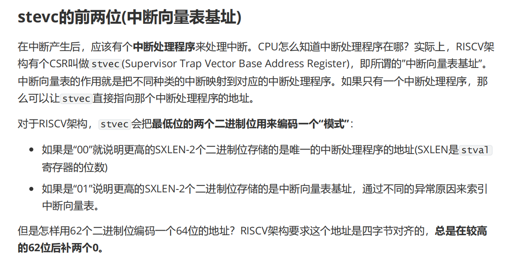
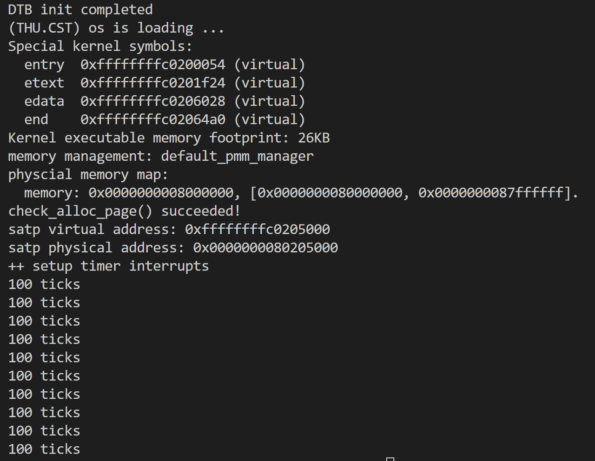
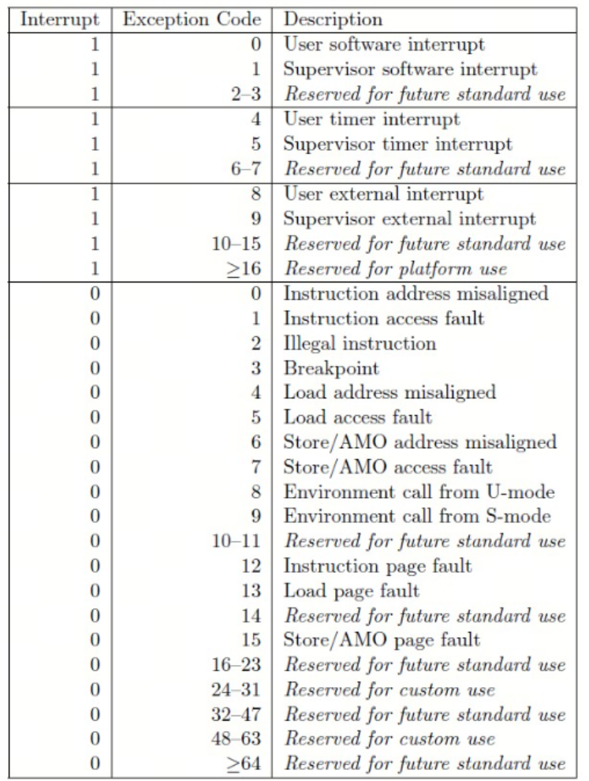
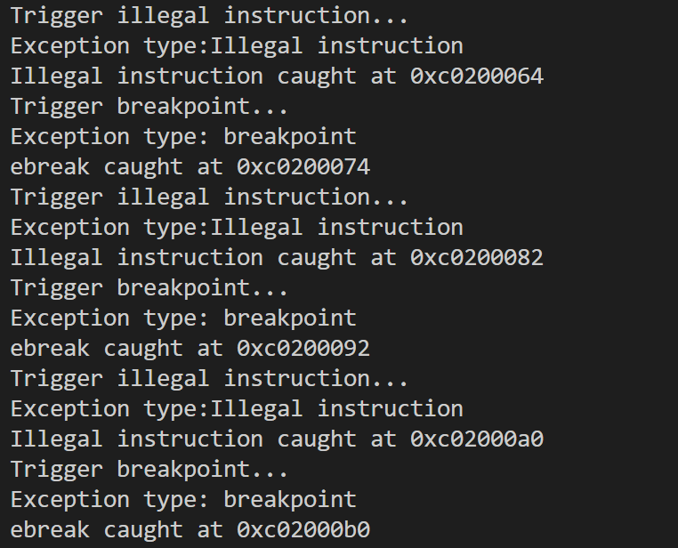

# 练习一

> 请编程完善trap.c中的中断处理函数trap，在对时钟中断进行处理的部分填写kern/trap/trap.c函数中处理时钟中断的部分，使操作系统每遇到100次时钟中断后，调用print\_ticks子程序，向屏幕上打印一行文字”100 ticks”，在打印完10行后调用sbi.h中的shut\_down()函数关机。
>
> 要求完成问题1提出的相关函数实现，提交改进后的源代码包（可以编译执行），并在实验报告中简要说明实现过程和定时器中断中断处理的流程。实现要求的部分代码后，运行整个系统，大约每1秒会输出一次”100 ticks”，输出10行。

### 问题

(1) **每个中断服务例程（ISR）的入口地址在哪里？**

* 所有 ISR 的入口地址都存储在 `__vectors` 中。

* `uintptr_t __vectors[]` 位于 `kern/trap/vector.S` 文件中，而该文件是由 vector.c 生成的。

* 运行 `make` 命令后，您将在 trap 目录中找到 `vector.S` 文件。

* 您可以使用 `extern uintptr_t __vectors[];` 来定义这个外部变量，以便稍后使用。

(2) **现在您需要在中断描述表（IDT）中设置 ISR 的条目。**

* 您是否在文件中看到了 `idt[256]`？是的，这是 IDT！

* 您可以使用 `SETGATE` 宏来设置 IDT 的每一项。

(3) 在设置完 IDT 的内容后，您需要通过 **`lidt` 指令让 CPU 知道 IDT 的位置。**

* 如果您不知道 `lidt` 指令的含义，可以通过 Google 搜索，并查看 `libs/x86.h` 文件以了解更多信息。

* 注意：`lidt` 的参数是 `idt_pd`，尝试找到它！

### 解答：

1. **ISR 的入口地址：**

   * `__vectors` 是一个数组，存储了每个中断服务例程（ISR）的入口地址。

   * **`tools/vector.c`**

   * 您需要在代码中声明 `extern uintptr_t __vectors[];`，以便在其他文件中引用这些入口地址。

2. **设置 IDT：**

   `IDT`（Interrupt Descriptor Table，中断描述符表）是一个数据结构，用于管理中断和异常的处理。它的主要作用是将中断向量号映射到对应的中断服务例程（ISR，Interrupt Service Routine）的入口地址。

   ### **作用**

   1. **中断向量管理**：

      * 每个中断或异常都有一个唯一的中断向量号（0-255）。

      * IDT 是一个包含 256 个条目的表，每个条目对应一个中断向量号。

      * 每个条目存储了该中断或异常的处理程序（ISR）的入口地址和相关属性。

   2. **中断分发**：

      * 当硬件或软件触发中断时，CPU 会根据中断向量号查找 IDT 中的对应条目。

      * CPU 跳转到条目中存储的 ISR 地址，执行中断处理程序。

   3) **异常处理**：

      * 除了硬件中断，IDT 还用于处理 CPU 产生的异常（如非法指令、除零错误等）。

   4) **特权级控制**：

      * IDT 条目中包含描述符特权级（DPL），用于控制哪些特权级的代码可以触发该中断。

      * 例如，某些中断只能由内核代码触发，而不能由用户代码触发。

   在 init.c 中，`idt_init()` 函数被调用来初始化 IDT：

   * **初始化 IDT**：

     * `idt_init()` 函数会设置 IDT 的每个条目，将中断向量号与对应的 ISR 关联起来。

     * 例如，时钟中断的向量号可能是 32，IDT 的第 32 个条目会存储时钟中断处理程序的入口地址

   * **加载 IDT**：

     * 初始化完成后，`lidt` 指令会将 IDT 的地址加载到 CPU 中，使其生效。

     * 从此，CPU 可以根据中断向量号查找 IDT，跳转到对应的 ISR。


3) **加载 IDT：**

   * idt和lidt是x86架构中的指令

   * riscv的中断处理机制是通过stvec寄存器设置中断入口地址。当发生中断时，CPU 会跳转到 `stvec` 中存储的地址。

   * **stvec的前两位（中断向量表基址）**

   

   * 将`__alltraps` 的地址写入 `stvec` 寄存器

     * `__alltraps`是一个标签，定义在汇编文件 `trapentry.S` 中，表示通用的中断入口

     * write\_csr(stvec, &\_\_alltraps);

     * **各文件的关系**：

       * trap.c：设置 `stvec` 的值，指向通用中断入口 `__alltraps`。

       * `riscv.h`：定义 `stvec` 寄存器的编号和访问接口。

       * `kernel.asm`：通过汇编指令 `csrw` 写入 `stvec`，完成中断入口地址的设置。

## 代码实现

clock\_set\_next\_event在clock.c中定义

每秒100次时钟中断，触发每次时钟中断后设置10ms后触发下一次时钟中断，每触发100次时钟中断（1秒钟）输出一行信息到控制台。

```verilog
         case IRQ_S_TIMER:
 /* LAB3 EXERCISE1   2311781 :  */
            /*(1)设置下次时钟中断- clock_set_next_event()
             *(2)计数器（ticks）加一
             *(3)当计数器加到100的时候，我们会输出一个`100ticks`表示我们触发了100次时钟中断，同时打印次数（num）加一
            * (4)判断打印次数，当打印次数为10时，调用<sbi.h>中的关机函数关机
            */
            clock_set_next_event(); // 设置下次时钟中断
            ticks++;
            if (ticks % 100 == 0) {
                print_ticks();
                print_count++;
                // 修改关机函数调用为正确的sbi_shutdown
                if (print_count == 10) {
                    sbi_shutdown(); // 调用关机函数
                }
            }
        break;
```

## 运行结果



# challenge1

> 回答：描述ucore中处理中断异常的流程（从异常的产生开始），其中mov a0，sp的目的是什么？SAVE\_ALL中寄寄存器保存在栈中的位置是什么确定的？对于任何中断，\_\_alltraps 中都需要保存所有寄存器吗？请说明理由。

## 中断异常处理流程

### 1. “**硬件进行中断和异常的发现”**

* **中断分类**：

  * 异常、陷入：用户程序（U特权级）执行非法操作（如访问无效内存地址、执行非法指令(除零)、发生缺页）、主动发起系统调用`ecall`或进入断点`ebreak`

  * 中断：外设产生外部中断（如时钟中断、键盘中断）时，CPU检测到异常并触发中断响应。

  * 在RISCV里，中断(`interrupt`)和异常(`exception`)统称为`trap`。

* **硬件先处理**：

  1. **保存中断发生时的`pc`值**，即程序计数器的值，这个值会被保存&#x5728;**`sepc`寄存器**中。对于异常来说，这通常是触发异常的指令地址，而对于中断来说，则是被打断的指令地址。

  2. **记录中断或异常的类型**，并将其写&#x5165;**`scause`寄存器**。这里的`scause`会告诉系统是中断还是异常，且会给出具体的中断类型。

  3. **保存相关的辅助信息**。如果异常与缺页或访问错误相关，将相关的地址或数据保存&#x5230;**`stval`寄存器**，以便中断处理程序在后续处理中使用。

  4. **保存并修改中断使能状态**。将当前的中断使能状&#x6001;**`sstatus.SIE`**&#x4FDD;存&#x5230;**`sstatus.SPIE`**&#x4E2D;，并且会&#x5C06;**`sstatus.SIE`清零**，从而禁用 S 模式下的中断。这是为了保证在处理中断时不会被其他中断打断。

  5. **保存当前的特权级信息**。将当前特权级（即 U 模式，值为 0）保存&#x5230;**`sstatus.SPP`**&#x4E2D;，并**切换特权级（从U级切换到内核态S级**。此时，系统已经进入 S 模式，准备跳转到中断处理程序。

  6. **将`pc`设置为`stvec`寄存器中的值**，并跳转到中断处理程序的入口（**`__alltraps`**）。

### 2. **“软件来进行处理”**

```assembly&#x20;language
    .globl __alltraps

.align(2) #中断入口点 __alltraps必须四字节对齐
__alltraps:
    SAVE_ALL #保存上下文

    move  a0, sp #传递参数。
    #按照RISCV calling convention, a0寄存器传递参数给接下来调用的函数trap。
    #trap是trap.c里面的一个C语言函数，也就是我们的中断处理程序
    jal trap 
    #trap函数指向完之后，会回到这里向下继续执行__trapret里面的内容，RESTORE_ALL,sret

    .globl __trapret
__trapret:
    RESTORE_ALL
    # return from supervisor call
    sret
```

#### 上下文保存、内核处理：`__alltraps`

* **进入**`__alltraps`：硬件完成基础压栈后，首先进入汇编实现的`__alltraps`函数。完成任务：完整保存上下文+jal trap

* 为什么能进来呢？因为

##### 上下文保存：寄存器到栈上

* **执行**`SAVE_ALL`宏：

  * 暂存原先的栈顶指针到sscratch

  * 让栈顶指针向低地址空间延伸 36个寄存器的空间，可以放下一个trapFrame结构体。

  * 依次保存32个通用寄存器。但栈顶指针需要特殊处理。

  * 保存栈顶指针 + 4个和中断有关的CSR

    * 栈顶指针：
      RISCV不能直接从CSR写到内存, 需要csrr把CSR读取到通用寄存器，再从通用寄存器STORE到内存：清零sscratch、s0 暂存其原始值

    * 保存sstatus、sepc、sbadaddr、scause

* **传递上下文地址**：执行`mov a0, sp`：

  * 将当前栈指针（sp）的值存入寄存器a0（函数调用的第一个参数寄存器），目的是将完整的上下文栈帧地址传递给后续C语言处理函数（如`trap`函数）

  * sp即存中断发生时已完成上下文保存的栈顶地址，是存放`TrapFrame`结构体的栈空间的起始地址（即栈顶地址）。

##### 真正的中断处理函数`trap`

* **调用C语言**`trap`函数：`__alltraps`在保存完上下文后，通过`jal trap`指令跳转到C语言实现的`trap`函数，此时a0寄存器携带的栈指针已指向完整的上下文栈帧（包含硬件压栈的EFLAGS/CS/EIP和`SAVE_ALL`压栈的通用寄存器）。

* **`trap_dispatch`中断类型识别与分发**：

  1. 通过读取`tf->cause`，判断中断/异常的类型（如系统调用、页错误、时钟中断、键盘中断等）；

  

  * 根据中断类型调用对应的处理函数--

    1. 触发`interrupt_handler(tf);`

    ```c
                case IRQ_S_TIMER:
                //时钟中断
                /* LAB3 EXERCISE2   YOUR CODE :  */
                /*(1)设置下次时钟中断
                 *(2)计数器（ticks）加一
                 *(3)当计数器加到100的时候，我们会输出一个`100ticks`表示我们触发了100次时钟中断，同时打印次数（num）加一
                * (4)判断打印次数，当打印次数为10时，调用<sbi.h>中的关机函数关机
                */
                break;
    ```

    * 触发`exception_handler(tf);`

    ```c
            case CAUSE_ILLEGAL_INSTRUCTION:
                //非法指令异常处理
                /* LAB3 CHALLENGE3   YOUR CODE :  */
                /*(1)输出指令异常类型（ Illegal instruction）
                 *(2)输出异常指令地址
                 *(3)更新 tf->epc寄存器
                 */
                 break;
            case CAUSE_BREAKPOINT:
                //非法指令异常处理
                /* LAB3 CHALLLENGE3   YOUR CODE :  */
                /*(1)输出指令异常类型（ breakpoint）
                 *(2)输出异常指令地址
                 *(3)更新 tf->epc寄存器
                 */
                 break;
    ```

* **执行具体处理逻辑**：处理函数完成业务逻辑（如系统调用执行文件读写、页错误处理内存映射、时钟中断触发进程调度），期间若需修改用户程序状态（如寄存器值），可直接操作a0指向的上下文栈帧（后续恢复时会生效）。

#### 上下文恢复、返回用户态：`__trapret`

* **返回**`__trapret`：`trap`函数处理完成后，通过`ret`指令回到汇编实现的`__trapret`（`__alltraps`的后续逻辑），此时栈指针仍指向保存上下文的栈帧。

* **执行**`RESTORE_ALL`宏：与`SAVE_ALL`对应，`RESTORE_ALL`宏恢复的顺序和当时保存的顺序反过来，先加载两个CSR, 再加载通用寄存器。

* **硬件现场恢复与特权级切换**：

  1. 根据中断或者异常的类型重新设置`sepc`，确保程序能够从正确的地址继续执行。对于系统调用，这通常是 `ecall`指令的下一条指令地址（即`sepc + 4`）；对于中断，这是被中断打断的指令地址（即`sepc`）；对于进程切换，这是新进程的起始地址。

  2. 然后，将`sstatus.SPP`设置为 0，表示要返回到 U 模式。

  3. 执行s`ret`指令；

  4. CPU跳回用户程序的中断点（EIP指向的指令），继续执行用户代码。

## 问题

### 1. `mov a0, sp`的目的是什么？

**`mov a0, sp`的核心目的是将“上下文栈帧的起始地址”作为参数传递给后续的C语言处理函数（如`trap`）**

* 中断处理需依赖完整的上下文信息（如中断号、错误码、用户态寄存器值），这些信息已通过`SAVE_ALL`和硬件压栈保存在栈中，形成一个连续的“上下文栈帧”（如`struct trapframe`结构体）；

* C语言函数调用遵循“参数传递约定”（如RISC-V的寄存器传参、x86的栈传参），`a0`是RISC-V架构中第一个函数参数的专用寄存器，将`sp`（栈帧起始地址）存入`a0`，可让`trap`函数直接通过该地址(tf)访问栈帧中的所有上下文数据

* 若不传递栈帧地址，C语言函数无法定位上下文数据，无法完成中断类型识别、寄存器修改等关键操作。

### 2. `SAVE_ALL`中寄存器保存在栈中的位置由什么确定？

**由trapframe结构体决定**，因为save\_all通过给栈顶指针加了36个regbytes的空间大小。

* ucore会定义一个固定结构的`struct trapframe`（陷阱帧），用于统一组织中断/异常发生时的所有上下文数据，其成员顺序明确规定了各寄存器、中断信息在栈中的存储位置。

  ```c
  struct trapframe {
      struct pushregs gpr;
      uintptr_t status;
      uintptr_t epc;
      uintptr_t badvaddr;
      uintptr_t cause;
  };
  ```

* `SAVE_ALL`宏的实现需与`struct trapframe`的成员顺序完全对齐：例如宏中先压栈`eax`，对应`tf_eax`的位置；再压栈`ebx`，对应`tf_ebx`的位置，以此类推。这种对齐确保了后续C语言函数通过`struct trapframe`指针访问栈帧时，能准确找到每个寄存器的值（如`tf->tf_ebx`就是`SAVE_ALL`压栈的ebx寄存器值）；

* 若`SAVE_ALL`的压栈顺序与`struct trapframe`的成员顺序不匹配，会导致上下文数据错乱（如读取到的`tf_eax`实际是`ebx`的值），进而引发内核崩溃或用户程序异常。

### 3. 对于任何中断，`__alltraps`中都需要保存所有寄存器吗？请说明理由。

**是的，对于任何中断，**`__alltraps`都需要保存所有通用寄存器。

* **内核与用户态的寄存器隔离**：内核处理中断时会使用CPU的通用寄存器（如执行`trap`函数时需用eax、ebx存储临时数据），若不提前保存用户态的寄存器值，内核操作会直接覆盖这些值，导致用户程序恢复后状态异常；

* **统一处理逻辑的简化性**：`__alltraps`是所有中断/异常的统一入口，若针对不同中断设计“部分保存”逻辑（如系统调用保存部分寄存器、时钟中断保存全部寄存器），会增加代码复杂度和出错概率。统一保存所有寄存器可确保处理逻辑简单、可靠，覆盖所有场景。

#### 其它

1. csrr s3, sbadaddr和STORE s3, 34\*REGBYTES(sp)两步的必要性

* RISCV不能直接从CSR写到内存, 需要csrr把CSR读取到通用寄存器，再从通用寄存器STORE到内存

- sscratch

  1. 临时存储

  2. 区分特权等级

  * `sscratch` 的值可以用来区分当前是从用户态进入内核态，还是内核态嵌套异常。

  * 例如，在 `trapentry.S` 中，`sscratch` 被设置为 0，表示当前处于内核态

- stvec: 用于指定异常或中断发生时，硬件跳转到的异常处理入口地址。

# challenge2

> 回答：在trapentry.S中汇编代码 csrw sscratch, sp；csrrw s0, sscratch, x0实现了什么操作，目的是什么？save all里面保存了stval scause这些csr，而在restore all里面却不还原它们？那这样store的意义何在呢？

### 1. `csrw sscratch, sp` 和 `csrrw s0, sscratch, x0` 的操作与目的

#### **操作：**

1. **`csrw sscratch, sp`**  因为后面要对sp暂时修改（低地址延伸36寄存器空间），所以暂存栈顶指针

2. **`csrrw s0, sscratch, x0`** &#x20;

   * 将 `sscratch` 的值（即之前保存的 `sp`）读入寄存器 `s0`（通用寄存器），同时将 `x0`（值为 0）写入 `sscratch`，清空 `sscratch`。

#### **目的：**

* **`csrw sscratch, sp`**&#x5728;陷入异常时，`sp` 保存了当前的栈指针。将其写入 `sscratch` 是为了在异常处理过程中，能够临时保存当前栈指针，防止嵌套异常导致栈指针丢失。

* **`csrrw s0, sscratch, x0`**&#x901A;过原子操作将 `sscratch` 的值取回到 `s0`，并清空 `sscratch`。这确保了：

  1. 当前异常处理过程中可以正确恢复栈指针。

  2. 如果发生嵌套异常，`sscratch` 为 0，表明当前已经处于内核态，避免重复保存栈指针。

***

### 2. 为什么 `SAVE_ALL` 保存了 `stval`（`sbadaddr`）、`scause` 等 CSR，但 `RESTORE_ALL` 不还原它们？

#### **保存的意义：**

* **`stval`**（`sbadaddr`）和 **`scause`** 是异常信息寄存器：

  * `stval` 保存了导致异常的虚拟地址（如非法访问地址）。

  * `scause` 保存了异常的原因（如非法指令、页错误等）。

* 在异常发生时，这些寄存器由硬件自动填充，内核需要读取这些信息来分析异常原因。

* 将它们保存到栈上是为了让 C 语言的`trap()`能够访问这些信息，进行调试、日志记录或进一步处理。

#### **不还原的原因：**

* **`stval`** 和 **`scause`** 是只读的异常信息寄存器，它们的值仅在异常发生时有意义。

* 在返回用户态时，这些寄存器的值会被硬件自动更新或覆盖，因此没有必要还原它们。

* 保存它们的意义仅在于供内核处理异常时使用，而不是为了恢复 CPU 的状态.

***

### 3. 总结

1. **`csrw sscratch, sp`** 和 **`csrrw s0, sscratch, x0` 的目的：**

   * 临时保存和恢复栈指针，确保异常处理过程中栈指针的正确性，防止嵌套异常导致栈混乱。

2. **保存 `stval`** 和 **`scause` 的意义：**

   * 供内核读取异常信息（如异常地址和原因），用于调试和处理。

   * 不需要还原，因为这些寄存器的值仅在异常发生时有意义，返回用户态时会被硬件自动更新或覆盖。

# challenge3

> 编程完善在触发一条非法指令异常 mret和，在 kern/trap/trap.c的异常处理函数中捕获，并对其进行处理，简单输出异常类型和异常指令触发地址，即“Illegal instruction caught at 0x(地址)”，“ebreak caught at 0x（地址）”与“Exception type:Illegal instruction"，“Exception type: breakpoint”。

## 核心代码实现

```c
case CAUSE_ILLEGAL_INSTRUCTION:
    cprintf("Exception type:Illegal instruction\n");
    cprintf("Illegal instruction caught at 0x%08x\n", tf->epc);
    /* 非法指令长度为 4 字节（RISC-V 基本指令集） */
    tf->epc += 4;
    break;

case CAUSE_BREAKPOINT:
    cprintf("Exception type: breakpoint\n");
    cprintf("ebreak caught at 0x%08x\n", tf->epc);
    tf->epc += 2;
    break;
```

当 CPU 在取指阶段遇到无法识别或不支持的指令时，会触发“非法指令异常”。`tf->epc` 表示异常发生时的指令地址，由于 RISC-V 基本指令集的指令长度为 4 字节，因此在处理异常后，将 `epc` 加 4，使程序返回时跳过这条非法指令，避免陷入死循环。

当执行 `ebreak` 指令时，会触发“断点异常”。`ebreak` 指令的长度为 2 字节（属于 RISC-V 的压缩指令格式之一），因此将 `epc` 增加 2，使程序在异常返回后继续执行断点后的指令。

## 相关检测代码

我在init.c文件中主要增加了如下代码来对书写程序进行验证，如下：

```c
void lab3_challenge3(void) {
    cprintf("Trigger illegal instruction...\n");
    asm volatile(".word 0xffffffff");  // 非法指令

    cprintf("Trigger breakpoint...\n");
    asm volatile("ebreak");  // 断点指令
}
```

开始时候我对`ebreak` 指令也是每次将 `epc` 增加 4，但是在检测过程中发现异常处理时陷入了死循环。后发现在`asm volatile("ebreak");`之后增加`asm volatile("nop");`指令可以解决死循环问题（而增加`asm volatile(".word 0xffffffff");` 并不可以）。

上网搜索发现是对`ebreak` 指令的长度认知错误导致的，增加`asm volatile("nop");`没有出现问题是因为它恰好也是2个字节，具有偶然性。因此对上方代码进行修改，成功解决死循环问题。

## 实验结果分析

如图所示：


发现异常类型和地址都正确输出，成功完成实验。

进行较为复杂的验证，即在lab3\_challenge3函数中多次重复已有代码，结果如下：



发现相关地址依然正确输出，实验成功。

