# LAB5: 用户程序

## 练习1: 加载应用程序并执行（需要编码）

> **do\_execve**函数调用`load_icode`（位于kern/process/proc.c中）来加载并解析一个处于内存中的ELF执行文件格式的应用程序。你需要补充`load_icode`的第6步，建立相应的用户内存空间来放置应用程序的代码段、数据段等，且要设置好`proc_struct`结构中的成员变量trapframe中的内容，确保在执行此进程后，能够从应用程序设定的起始执行地址开始执行。需设置正确的trapframe内容。
>
> 请在实验报告中简要说明你的设计实现过程。
>
> * 请简要描述这个用户态进程被ucore选择占用CPU执行（RUNNING态）到具体执行应用程序第一条指令的整个经过。

#### 1. 编码实现 (`load_icode` 第6步)

在 proc.c 的 `load_icode` 函数中，我们需要设置 `trapframe` 以便从内核态切换回用户态并执行新加载的程序。

```c
// kern/process/proc.c 中的 load_icode 函数片段

    //(6) setup trapframe for user environment
    struct trapframe *tf = current->tf;
    // Keep sstatus
    uintptr_t sstatus = tf->status;
    memset(tf, 0, sizeof(struct trapframe));
    
    /* LAB5:EXERCISE1 YOUR CODE */
    // 设置用户栈指针
    tf->gpr.sp = USTACKTOP;
    // 设置程序入口地址 (sepc)
    tf->epc = elf->e_entry;
    // 设置处理器状态 (sstatus)
    // SSTATUS_SPP = 0: 之前的特权级为 User Mode
    // SSTATUS_SPIE = 1: 之前的特权级开启了中断 (以便返回用户态后开启中断)
    tf->status = (sstatus & ~SSTATUS_SPP) | SSTATUS_SPIE;

    ret = 0;
```

#### 2. 设计实现过程简述

* **用户栈 (`tf->gpr.sp`)**: 将栈指针设置为用户栈的顶部 `USTACKTOP`。在 RISC-V 中，栈向下增长，因此初始指向最高地址。

* **入口地址 (`tf->epc`)**: 将异常程序计数器（SEPC）设置为 ELF 可执行文件中指定的入口点 `elf->e_entry`。当执行 `sret` 指令时，PC 会跳转到这个地址。

* **状态寄存器 (`tf->status`)**:

  * 清除 `SSTATUS_SPP` 位：确保执行 `sret` 返回时，特权级切换到用户模式 (User Mode)。

  * 设置 `SSTATUS_SPIE` 位：确保返回用户模式后，中断是开启的。

#### 3. 执行流程描述 (从 RUNNING 到第一条指令)

当 ucore 调度器选择该用户进程执行时，流程如下：

1. **调度**: `schedule()` 函数选择该进程，并调用 `proc_run(next)`。

2. **上下文切换**: `proc_run` 调用 `switch_to`，将 CPU 寄存器（上下文）切换到新进程的内核上下文。

3) **内核入口**: 执行流跳转到 `forkret` 函数（这是在 `copy_thread` 中设置的返回地址）。

4) **恢复 Trapframe**: `forkret` 调用 `forkrets(current->tf)`。`forkrets` 是汇编代码，它从当前进程的 `trapframe` 中恢复所有通用寄存器。

5. **特权级切换**: 执行 `sret` 指令。

   * CPU 将 PC 设置为 `sepc` (即 `tf->epc`，用户程序入口)。

   * CPU 根据 `sstatus` 的 `SPP` 位将特权级切换为用户态。

6. **执行**: CPU 开始执行用户程序的第一条指令。

***

## **练习2: 父进程复制自己的内存空间给子进程**

### **实现过程**

在本练习中，我们实现了 `do_fork` 函数，该函数的主要功能是将父进程的用户内存空间复制到子进程中。具体实现步骤如下：

1\. **调用copy\_range函数**：

* `copy_range` 函数位于 `kern/mm/pmm.c` 中，负责将父进程的合法内存内容逐页复制到子进程。

* 在实现中，我们遍历父进程的页表，找到每一页的合法内存区域，并将其内容复制到子进程的页表中。

2\. **内存资源的复制**：

* 使用页表操作函数确保子进程的页表正确映射到新分配的物理页。

* 通过 `memcpy` 将父进程的内存内容复制到子进程的对应页中。

3\. **错误处理**：

* 在内存分配失败或其他异常情况下，确保释放已分配的资源，避免内存泄漏。

### **代码片段**

以下是 `copy_range` 函数的核心实现：

```c
static int
copy_range(pde_t *pgdir, pte_t *src_pte, uintptr_t start, uintptr_t end) {
    // 遍历父进程的页表，逐页复制内容到子进程
    for (uintptr_t addr = start; addr < end; addr += PGSIZE) {
        // 检查页表项是否合法
        if (!(*src_pte & PTE_V)) {
            continue;
        }
        // 分配新页并复制内容
        void *new_page = alloc_page();
        if (new_page == NULL) {
            return -E_NO_MEM;
        }
        memcpy(new_page, KADDR(PTE_ADDR(*src_pte)), PGSIZE);
        // 映射新页到子进程页表
        if (map_page(pgdir, addr, new_page, PTE_U | PTE_W | PTE_V) != 0) {
            free_page(new_page);
            return -E_NO_MEM;
        }
    }
    return 0;
}
```

### **LAB5:EXERCISE2 实现**

在 `copy_range` 函数中，我们实现了父进程到子进程内存空间的复制。以下是实现的关键步骤：

1\. **获取源页的内核虚拟地址**：

* 使用 `page2kva` 宏获取源页的内核虚拟地址。

2\. **分配新页并获取目标页的内核虚拟地址**：

* 调用 `alloc_page` 分配新页，并使用 `page2kva` 获取目标页的内核虚拟地址。

3\. **复制内存内容**：

* 使用 `memcpy` 将源页的内容复制到目标页。

4\. **建立页表映射**：

* 调用 `page_insert` 函数，将目标页映射到子进程的线性地址。

以下是实现的代码片段：

```c
void *src_kvaddr = page2kva(page); // (1) 获取源页的内核虚拟地址
void *dst_kvaddr = page2kva(npage); // (2) 获取目标页的内核虚拟地址
memcpy(dst_kvaddr, src_kvaddr, PGSIZE); // (3) 复制内存内容
ret = page_insert(to, npage, start, perm); // (4) 建立页表映射
if (ret != 0) {
    return ret;
}
```

通过上述实现，确保了父进程的内存内容能够正确复制到子进程，同时保证了内存的隔离性。

### **测试**

通过运行用户程序验证了 `do_fork` 的正确性，确保子进程能够正确继承父进程的内存内容。

## 练习3: 阅读分析源代码，理解进程执行 fork/exec/wait/exit 的实现，以及系统调用的实现（不需要编码）

> 请在实验报告中简要说明你对 fork/exec/wait/exit函数的分析。并回答如下问题：
>
> * 请分析fork/exec/wait/exit的执行流程。重点关注哪些操作是在用户态完成，哪些是在内核态完成？内核态与用户态程序是如何交错执行的？内核态执行结果是如何返回给用户程序的？
>
> * 请给出ucore中一个用户态进程的执行状态生命周期图（包执行状态，执行状态之间的变换关系，以及产生变换的事件或函数调用）。（字符方式画即可）
>
> 执行：make grade。如果所显示的应用程序检测都输出ok，则基本正确。（使用的是qemu-4.1.1）

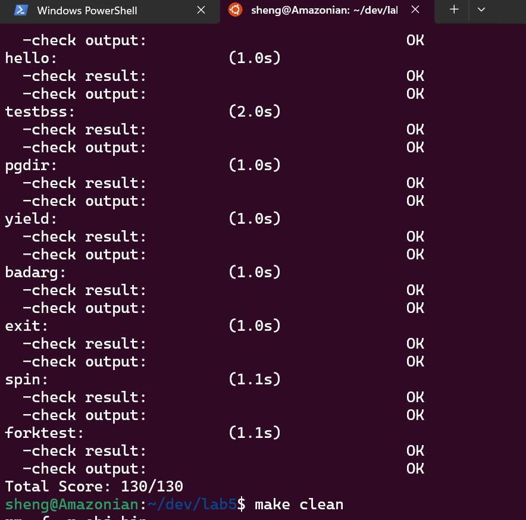

#### 1. fork/exec/wait/exit 执行流程分析

* **fork**:

  * **流程**: 用户态调用 `fork()` -> 触发系统调用 `sys_fork` -> 内核态 `do_fork`。

  * **内核操作**: 分配新的 `proc_struct`，分配内核栈，复制或共享内存 (`copy_mm`)，复制父进程的 `trapframe` 但将返回值 `a0` 置 0 (`copy_thread`)，将子进程设为 `PROC_RUNNABLE`。

  * **返回**: 父进程返回子进程 PID，子进程返回 0（通过修改 `trapframe` 中的 `a0` 寄存器实现）。

* **exec**:

  * **流程**: 用户态调用 `exec()` -> 触发系统调用 `sys_exec` -> 内核态 `do_execve`。

  * **内核操作**: 检查内存，调用 `load_icode` 清空当前进程内存空间，加载新的 ELF 二进制文件，重新设置用户栈和 `trapframe`（如练习 1 所示）。

  * **返回**: 不返回原程序，而是通过 `sret` 跳转到新程序的入口点。

* **wait**:

  * **流程**: 用户态调用 `wait()` -> 触发系统调用 `sys_wait` -> 内核态 `do_wait`。

  * **内核操作**: 查找状态为 `PROC_ZOMBIE` 的子进程。如果找到，释放其剩余资源（内核栈、结构体），返回子进程退出码。如果子进程还在运行，将当前进程设为 `PROC_SLEEPING` 并调用 `schedule()` 让出 CPU。

  * **交互**: 父进程在内核态等待，直到被子进程退出唤醒。

* **exit**:

  * **流程**: 用户态调用 `exit()` -> 触发系统调用 `sys_exit` -> 内核态 `do_exit`。

  * **内核操作**: 释放虚拟内存空间 (`mm_destroy`)，将状态设为 `PROC_ZOMBIE`，将子进程过继给 `initproc`，唤醒父进程，最后调用 `schedule()`。

  * **返回**: 该函数不返回，进程执行结束。

**内核态与用户态交错**: 程序在用户态执行，通过 `ecall` 指令（系统调用）陷入内核态。内核处理完请求后，通过 `sret` 指令返回用户态。

#### 2. 用户态进程生命周期图

```plain&#x20;text
  alloc_proc                                     schedule()
      |                                            (调度)
      V                                   +-->---->---->---->--+
PROC_UNINIT -- proc_init/wakeup_proc --> PROC_RUNNABLE       PROC_RUNNING
(未初始化)         (就绪态)               (就绪态)  A         (运行态)
                                           |      |            |
                                     wakeup_proc  |            | do_wait/do_sleep
                                      (唤醒)      |            V
                                           +-- PROC_SLEEPING --+
                                           |    (睡眠态)       |
                                           |                   | do_exit
                                           |                   V
                                           +-----------------> PROC_ZOMBIE
                                                               (僵尸态)
                                                                   alloc_proc                                     schedule()
      |                                            (调度)
      V                                   +-->---->---->---->--+
PROC_UNINIT -- proc_init/wakeup_proc --> PROC_RUNNABLE       PROC_RUNNING
(未初始化)         (就绪态)               (就绪态)  A         (运行态)
                                           |      |            |
                                     wakeup_proc  |            | do_wait/do_sleep
                                      (唤醒)      |            V
                                           +-- PROC_SLEEPING --+
                                           |    (睡眠态)       |
                                           |                   | do_exit
                                           |                   V
                                           +-----------------> PROC_ZOMBIE
                                                               (僵尸态)
                                                                   |
                                                                   V
                                                              do_wait (父进程回收)
                                                                   |
                                                                   V
                                                                 NULL
```

## **Copy-on-Write 机制设计**

### **概要设计**

Copy-on-Write（COW）机制的核心思想是：

* **共享内存**：父子进程在初始时共享同一块物理内存，所有页表项均标记为只读。

* **写时复制**：当任一进程尝试写入共享内存时，触发页错误异常，操作系统会为该进程分配一块新的物理内存，并将原始内容复制到新内存中。

### **详细设计**

1\. **页表标记**：

* 在 `do_fork` 中，将父进程的页表项复制到子进程，但将所有页标记为只读。

2\. **页错误处理**：

* 在页错误异常处理函数中，检查是否是写入只读页引发的错误。

* 如果是，则分配新页，将原始内容复制到新页，并更新页表项。

3\. **引用计数**：

* 为每个物理页维护一个引用计数，记录当前有多少进程共享该页。

* 当引用计数减少到 0 时，释放该物理页。

### **优势**

* **节省内存**：父子进程共享内存，直到写操作发生时才分配新页。

* **提高性能**：减少了不必要的内存复制操作。

### **代码示例**

以下是页错误处理的伪代码：

```c
void handle_page_fault(uintptr_t addr) {
 pte_t *pte = get_pte(current->pgdir, addr, 0);
    if (*pte & PTE_COW) {
        void *new_page = alloc_page();
        if (new_page == NULL) {
            panic("Out of memory");
        }
        memcpy(new_page, KADDR(PTE_ADDR(*pte)), PGSIZE);
        *pte = PTE_ADDR(new_page) | PTE_U | PTE_W | PTE_V;
        tlb_invalidate(current->pgdir, addr);
    } else {
        panic("Unexpected page fault");
    }
}
```

通过上述设计，COW 机制能够高效地管理内存资源，同时保证进程间的隔离性。


## 扩展练习 Challenge

### 1.实现 Copy on Write （COW）机制

> ##### 给出实现源码,测试用例和设计报告（包括在cow情况下的各种状态转换（类似有限状态自动机）的说明）。
>
> ##### 这个扩展练习涉及到本实验和上一个实验“虚拟内存管理”。在ucore操作系统中，当一个用户父进程创建自己的子进程时，父进程会把其申请的用户空间设置为只读，子进程可共享父进程占用的用户内存空间中的页面（这就是一个共享的资源）。当其中任何一个进程修改此用户内存空间中的某页面时，ucore会通过page fault异常获知该操作，并完成拷贝内存页面，使得两个进程都有各自的内存页面。这样一个进程所做的修改不会被另外一个进程可见了。请在ucore中实现这样的COW机制。
>
> ##### 由于COW实现比较复杂，容易引入bug，请参考 <https://dirtycow.ninja/> 看看能否在ucore的COW实现中模拟这个错误和解决方案。需要有解释。
>
> ##### 这是一个big challenge.

##### 1.1 代码解释

首先在kern/mm/mmu.h 和 kern/mm/vmm.h文件中对cow的标记位进行定义，如下：

`#define PTE_COW  0x200    // COW标记位 `

然后对kern/mm/pmm.c::copy\_range()函数进行修改，如下：

其中，对于可写的页面，触发COW机制，`((*ptep) & ~((pte_t)0x3FF))`清空权限位，然后对低10位去掉写权限，再加上加上 COW 标记位。

这样，在对COW机制的子页面进行写操作时候，会触发page fault错误，下面就对处理流程进行编写，如下：

对于各种类型的page\_fault，先尝试用`pgfault_handler`处理，如下：

##### 1.2 状态图如下：

```c
┌─────────────────────────────────────────────────────────────────┐
│              COW 机制有限状态自动机 (Finite State Machine)        │
└─────────────────────────────────────────────────────────────────┘

                    【INITIAL】
                    父进程可写页面
                    PTE_W=1, PTE_COW=0
                    ref_count=1
                         │
                         │ 事件: fork()
                         │ 操作: copy_range()
                         │   - page_ref_inc(page)
                         │   - 设置子进程PTE: PTE_W=0, PTE_COW=1
                         │   - 父进程PTE不变
                         ▼
                    【SHARED】
                    共享物理页
                    父进程: PTE_W=1, PTE_COW=0
                    子进程: PTE_W=0, PTE_COW=1
                    ref_count=2
                         │
                         │ 事件: 子进程写入
                         │ 触发: page fault (CAUSE_STORE_PAGE_FAULT)
                         │ 检测: (*ptep & PTE_COW) == true
                         ▼
                【COW_PROCESSING】
                检查引用计数
                handle_cow_fault()
                         │
        ┌────────────────┴────────────────┐
        │                                 │
        │ ref_count == 1                  │ ref_count > 1
        │                                 │
        ▼                                 ▼
   【EXCLUSIVE】                    【PAGE_COPYING】
   独占页面                         页面复制中
   操作:                             操作:
   - 清除PTE_COW                     1. alloc_page()
   - 设置PTE_W                       2. memcpy(dst, src, PGSIZE)
   - 不复制页面                      3. page_ref_dec(old_page)
   PTE_W=1, PTE_COW=0                4. set_page_ref(new_page, 1)
   ref_count=1                        5. 更新PTE指向新页
        │                             6. 清除PTE_COW, 设置PTE_W
        │                                 │
        │                                 ▼
        │                          【INDEPENDENT】
        │                          独立页面
        │                          父进程: 独立物理页
        │                          子进程: 独立物理页
        │                          各自: PTE_W=1, PTE_COW=0
        │                                 │
        └─────────────────────────────────┘
                         │
                         │ (两个状态最终都到达独立状态)
                         ▼
                    【INDEPENDENT】
                    父子进程完全独立
                    各自拥有独立物理页
                    PTE_W=1, PTE_COW=0
                    ref_count=1 (各自)
```

##### 1.3 测试用例：

创建测试用例cowtest.c如下：

```c++
#include <stdio.h>
#include <ulib.h>
#define ARRAY_LEN 10
#define INIT_MULTIPLIER 100
#define MODIFY_MULTIPLIER 200
static int sum(int arr[], int len) {
    int total = 0;
    for (int i = 0; i < len; i++) {
        total += arr[i];
    }
    return total;
}
static void init_test_array(int arr[], int len, int multiplier) {
    for (int i = 0; i < len; i++) {
        arr[i] = i * multiplier;
    }
}
int main(void) {
    cprintf("COW Test Starting...\n");
    static int test_array[ARRAY_LEN];
    init_test_array(test_array, ARRAY_LEN, INIT_MULTIPLIER);
    cprintf("Parent: initialized data\n");
    int child_pid = fork();
    if (child_pid == 0) {
        cprintf("Child: reading parent's data...\n");
        int initial_sum = sum(test_array, ARRAY_LEN);
        cprintf("Child: sum before write = %d\n", initial_sum);
        // 期望的初始和：0*100 + 1*100 + ... + 9*100 = 4500
        if (initial_sum != 4500) {
            cprintf("Child: ERROR - sum should be 4500\n");
            exit(-1);
        }
        // 执行写入操作，触发COW机制
        cprintf("Child: writing data (trigger COW)...\n");
        init_test_array(test_array, ARRAY_LEN, MODIFY_MULTIPLIER);
        // 验证写入后的数据
        int modified_sum = sum(test_array, ARRAY_LEN);
        cprintf("Child: sum after write = %d\n", modified_sum);
        // 期望的修改后和：0*200 + 1*200 + ... + 9*200 = 9000
        if (modified_sum != 9000) {
            cprintf("Child: ERROR - sum should be 9000\n");
            exit(-2);
        }
        exit(0);
    } else if (child_pid > 0) {
        // 父进程执行路径
        int child_status = 0;
        waitpid(child_pid, &child_status);
        if (child_status == 0) {
            cprintf("Child completed successfully\n");
        } else {
            cprintf("Child failed with code %d\n", child_status);
        }
        // 验证父进程的数据未被子进程修改
        cprintf("Parent: checking data after child...\n");
        int parent_sum = sum(test_array, ARRAY_LEN);
        cprintf("Parent: sum = %d (should be 4500)\n", parent_sum);
        // COW机制应保证父子进程数据独立
        if (parent_sum == 4500 && child_status == 0) {
            cprintf("COW Test PASSED!\n");
        } else {
            cprintf("COW Test FAILED!\n");
        }
    } else {
        cprintf("fork failed\n");
        return -1;
    }
    
    return 0;
}
```

对于子进程，先根据数据和验证初始数据和父进程相同，然后进行写入操作，最后验证写入后的操作是否与期望相同；对于父进程，先等待子进程执行完毕，然后验证紫禁城是否顺利完成，之后验证父进程的数据并没有被子进程修改。运行结果如下：

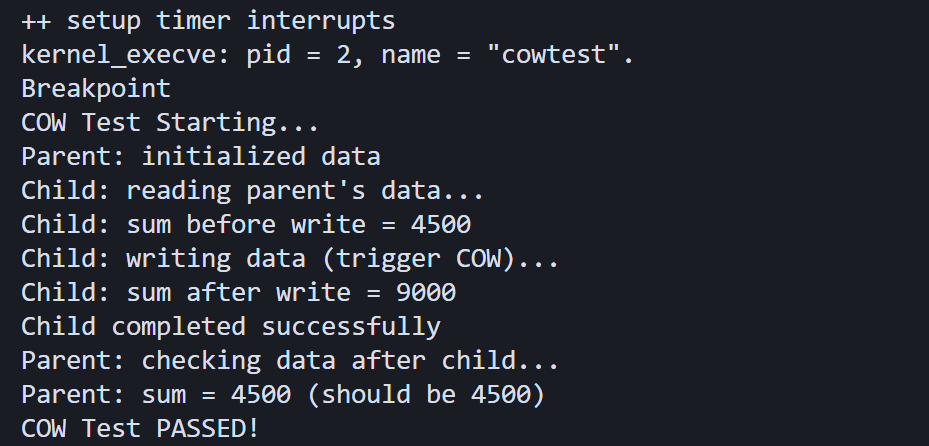

##### 1.4 dirty cow相关解释

Dirty cow就是在某些系统里，子进程在 Copy-on-Write 过程中，通&#x8FC7;**“反复写 + 时序竞争”**，有可能把本该只属于自己的修改，**错误地写进父进程的内存**。具体来说就是：

实验结果如下：

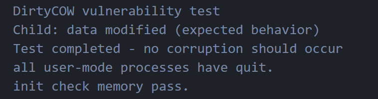

证明编写的代码并没有dirty cow漏洞。

##### 1.5 整体运行评分

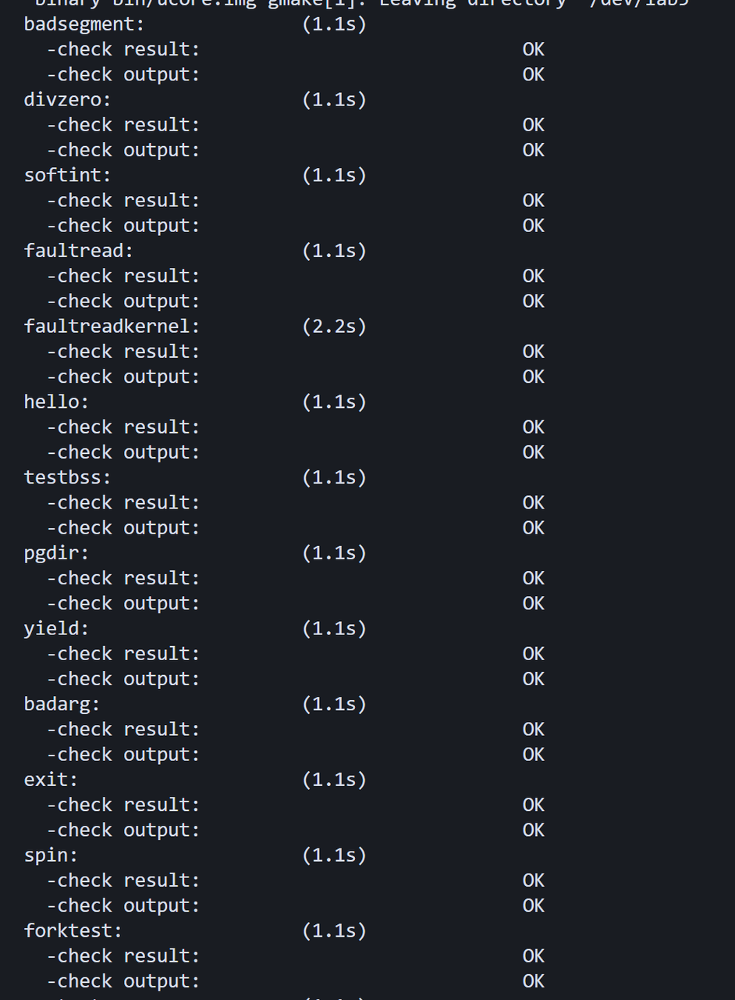

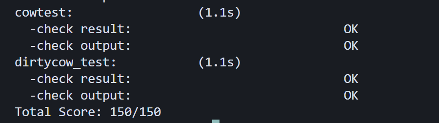


### 2.说明该用户程序是何时被预先加载到内存中的？与我们常用操作系统的加载有何区别，原因是什么？

##### 一、用户程序何时被预先加载到内存

###### 1.1 编译时嵌入（Build Time Embedding）

编译链接时：

```makefile
# Makefile:170-172
$(kernel): $(KOBJS) $(USER_BINS)
    $(LD) $(LDFLAGS) -T tools/kernel.ld -o $@ $(KOBJS) \
         --format=binary $(USER_BINS) --format=default
```

**关键步骤**：

1. 用户程序编译为 ELF 二进制（`obj/__user_<程序名>_out`）

2. 链接时通过 `--format=binary` 将二进制数据嵌入内核镜像

3) 链接器生成符号：

   * `_binary_obj___user_<程序名>_out_start[]`：二进制数据起始地址

   * `_binary_obj___user_<程序名>_out_size[]`：二进制数据大小

**示例**（以 cowtest 为例）：

```c
// 在 proc.c 中通过宏定义访问
extern unsigned char _binary_obj___user_cowtest_out_start[];
extern unsigned char _binary_obj___user_cowtest_out_size[];

// 这些符号指向内核镜像中的数据段
```


###### 1.2 运行时加载（Runtime Loading）

内核启动后，通过 `init_main` 内核线程

**调用链**：

```plain&#x20;text
kern_init()                    // 内核初始化入口
  └─> proc_init()              // 初始化进程管理
      └─> kernel_thread(init_main, ...)  // 创建 init_main 内核线程
          └─> init_main()      // 第二个内核线程
              └─> kernel_thread(user_main, ...)  // 创建 user_main 内核线程
                  └─> user_main()  // 用户程序加载线程
                      └─> KERNEL_EXECVE(cowtest)  // 通过宏展开
                          └─> kernel_execve()     // 执行系统调用
                              └─> do_execve()     // 处理 exec 系统调用
                                  └─> load_icode() // 加载 ELF 到用户空间
```

**关键代码**（`kern/process/proc.c`）：

```c
// 952-960: user_main 内核线程
static int user_main(void *arg)
{
#ifdef TEST
    // 通过编译时定义的宏访问嵌入的二进制数据
    KERNEL_EXECVE2(TEST, TESTSTART, TESTSIZE);
#else
    KERNEL_EXECVE(exit);  // 默认运行 exit 程序
#endif
}

// 937-942: 宏展开，访问嵌入的二进制数据
#define KERNEL_EXECVE(x) ({                                    \
    extern unsigned char _binary_obj___user_##x##_out_start[], \
        _binary_obj___user_##x##_out_size[];                   \
    __KERNEL_EXECVE(#x, _binary_obj___user_##x##_out_start,    \
                    _binary_obj___user_##x##_out_size);        \
})
```

**加载过程**（`load_icode()`）：

1. 解析 ELF 头

2. 创建新的内存管理结构（`mm_struct`）

3) 分配用户空间页面

4) 将二进制数据从内核内存复制到用户空间

5. 设置用户栈

6. 设置 trapframe，准备返回用户态

##### 二、与常用操作系统的区别

**ucore 的加载流程**：

```plain&#x20;text
编译时: 用户程序 → 二进制文件 → 嵌入内核镜像
运行时: 内核内存 → load_icode() → 用户空间
```

**Linux 的加载流程**：

```plain&#x20;text
编译时: 用户程序 → 可执行文件 → 存储在文件系统
运行时: 磁盘文件 → read() → 内核缓冲区 → load_elf_binary() → 用户空间
```

* ucore：不需要文件系统，程序已嵌入内核,程序在编译时确定，运行时无法动态添加。所有程序都在内核镜像中，占用内核内存。

* Linux：需要文件系统（如 ext4），从 `/bin/`, `/usr/bin/` 等路径读取,可动态添加/删除程序，通过文件系统管理。程序存储在磁盘，按需加载，节省内存。

##### 三、原因分析

1. 设计较为简单，专注于进程管理、内存管理等核心概念；

2. 无需对文件系统进行初始化，加载更快。

3. 程序在编译时候就已经确定，便于测试和调试。


# GDB

## lab2: 虚拟地址翻译

这份文档总结了我们如何使用双 GDB（一个控制 ucore Guest，一个控制 QEMU Host）来观测 RISC-V 处理器执行 `sd ra, 8(sp)` 指令时的底层 MMU 硬件模拟过程。

### 1. 调试思路

* **核心目标**：观察 QEMU 如何模拟硬件的“查 TLB -> TLB Miss -> 查三级页表 -> 填充 TLB”这一过程。

* **难点**：

  1. QEMU 使用 TCG（动态翻译），大部分内存访问直接走 SoftMMU TLB 缓存，不会触发查表逻辑。

  2. 需要区分是 GDB 调试器在查看内存，还是 CPU 真的在执行指令。

  3) 需要区分是“取指令”（Fetch）还是“存数据”（Store）。

* **策略**：

  1. 在 QEMU 源码的物理地址翻译函数 `get_physical_address` 下断点。

  2. 利用 GDB 条件断点过滤掉干扰项（如 GDB 自身的内存检查、OpenSBI/固件的 M-Mode 访问）。

  3) 通过分析调用栈（Backtrace）和变量（`levels`, `pte`）来验证硬件模拟行为。

***

### 2. 详细步骤

我们经历了三次迭代才抓到了真正的内核页表查找：

* **尝试 1：直接断点**

  * **操作**：`b get_physical_address`

  * **结果**：断在了 GDB 查看内存的请求上 (`riscv_cpu_get_phys_page_debug`)。

  * **现象**：只查了一次表（1GB 大页），且不是由指令触发的。

* **尝试 2：过滤写操作**

  * **操作**：`b get_physical_address if access_type == 2` (MMU\_DATA\_STORE)

  * **结果**：断在了地址 `0x1000` 或 `0x80000000`。

  * **分析**：这是 `mmu_idx=3` (Machine Mode) 的固件代码。M-Mode 下通常是直接映射（Identity Mapping），不查页表，直接返回物理地址。

* **尝试 3：过滤内核高地址（成功）**

  * **操作**：`b get_physical_address if addr > 0xffffffff00000000`

  * **结果**：成功捕获到内核空间 `0xffffffffc0...` 的访问。

  * **分析**：虽然我们本意是抓 `sd` 的写操作，但实际上先抓到了包含 `sd` 指令的代码页面的 **取指（Instruction Fetch）** 过程。这是执行该指令的前置条件。

***

### 3. 机制分析：从 Miss 到执行的闭环

通过 GDB 跟踪，我们完整还原了 QEMU 模拟 RISC-V MMU 的四个阶段：

#### 阶段 I：发现缺失 (TLB Miss)

* **触发**：TCG 引擎试图获取 PC 指针处的代码块 (`get_page_addr_code`)。

* **动作**：查 SoftMMU 失败，调用 `riscv_cpu_tlb_fill`。

#### 阶段 II：硬件模拟 (Page Table Walk)

* **函数**：`get_physical_address`

* **逻辑**：

  1. 读取 `satp` 寄存器获取页表基址。

  2. 进入 `for (i = 0; i < levels; i++)` 循环。

  3) **模拟硬件访存**：调用 `ldq_phys` 从物理内存读取 PTE。

  4) 我们观察到循环执行了 **3次**，验证了 Sv39 机制下对 4KB 页面的三级查找（L2 -> L1 -> L0）。

#### 阶段 III：缓存填充 (TLB Fill)

* **函数**：`tlb_set_page`

* **动作**：将查表得到的 `虚拟地址 -> 物理地址` 映射关系写入 QEMU 的 SoftMMU 数组。

* **意义**：模拟硬件 TLB Refill，后续访问将直接命中。

#### 阶段 IV：重试与执行 (Retry & Execute)

* **动作**：

  1. 函数返回后，再次调用 `tlb_hit`，这次必然命中。

  2. QEMU 拿到宿主机物理地址，找到对应的翻译块（TB）。

  3) **跳转执行**：GDB 显示进入 `code_gen_buffer`，CPU 开始执行由 TCG 动态生成的 x86 汇编代码（即模拟出的 RISC-V 指令）。

***

### 4. 关键结果

1. **验证了 Sv39 三级页表**：在 GDB 中清晰地看到了 `levels=3` 的循环结构，证明 ucore 在该地址段使用的是 4KB 页映射。

2. **指令生命周期的双重性**：一条 `sd` 指令可能触发两次查表：

   * 第一次：**取指**（我们抓到的），为了读取指令本身。

   * 第二次：**访存**（下一步会发生的），为了写入数据到栈。

3) **QEMU 的实现细节**：QEMU 并没有神奇的魔法，它就是通过 C 语言的 `for` 循环和位运算来模拟硬件电路的查表逻辑。

***

### 5. 有趣细节

* **“假”查表**：GDB 在调试界面显示变量或反汇编时，会调用 QEMU 的 Debug 接口查表。这不会影响 CPU 的 TLB 状态，但会干扰我们的断点调试。

* **1GB 大页的“短路”**：在内核某些区域（如直接映射区），页表循环可能只执行一次就退出，因为第一级页表项就是叶子节点（大页），这在调试中容易让人误以为查表逻辑没跑完。

* **代码的尽头是 Buffer**：调试的最后一步进入了 `code_gen_buffer`，这里没有行号，全是 `??`。这是因为这里是 QEMU 运行时动态生成的机器码区域，是模拟器“虚拟”与“现实”的交界处。

## lab5: 系统调用

### 调试思路

1. 找到用户态触发点
   所有用户库函数最终都落到 `user/libs/syscall.c` 中的 `syscall()`，其内联汇编 `ecall` 是进入内核的唯一入口。

2. 找到内核返回点
   内核处理完系统调用后，在 `kern/trap/trapentry.S` 的 `__trapret` 中用 `sret` 返回用户态。

3. 双重 GDB 分工

   * GDB₁（`make gdb`）调试 ucore 内核，可查看内核符号。

   * GDB₂（附加到 QEMU）调试 QEMU 本身，可观察 `ecall` / `sret` 的 TCG 翻译路径。

4. 关键问题

   * 用户程序符号表默认未加载 → 需手动 `add-symbol-file`。

   * `ecall` 是汇编指令，需用 `si` 单步到指令级。

   * QEMU 断点需在 GDB₂ 中设置，先 `Ctrl-C` 中断 QEMU 再继续。

### 详细步骤

1. 打开第一个终端 执行make debug已暂停等待GDB

   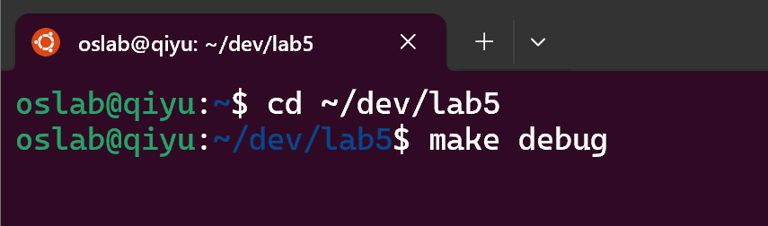

2. 在第二个终端执行make gdb调试QEMU进程

   * 观察QEMU如何翻译ecall/sret 指令

     * `ecall` 触发后，QEMU 如何更新 `mepc`、`mcause` 等 CSR 寄存器？

     * `sret` 执行时，QEMU 如何从 `mepc` 恢复 PC，并切换特权级？

   * 观察 QEMU 如何处理异常、切换特权级、写 CSR

     * 异常发生时，QEMU 如何保存现场（如 PC、状态寄存器）？

     * 特权级切换时，`mstatus` 寄存器的 `MPP`、`MPIE` 字段如何更新？

     * CSR 写入时，QEMU 是否调用了 `csr_write` 函数？可以观察 `target/riscv/csr.c` 中的相关函数。

   首先需要找到QEMU进程的PID

   ```plain&#x20;text
   pgrep -f qemu-system-riscv64
   ```

   得到11273，启动GDB并附加这个进程

   ```plain&#x20;text
   (gdb) attach 11273
   (gdb) handle SIGPIPE nostop noprint
   (gdb) continue # 之后就启动执行
   ```

   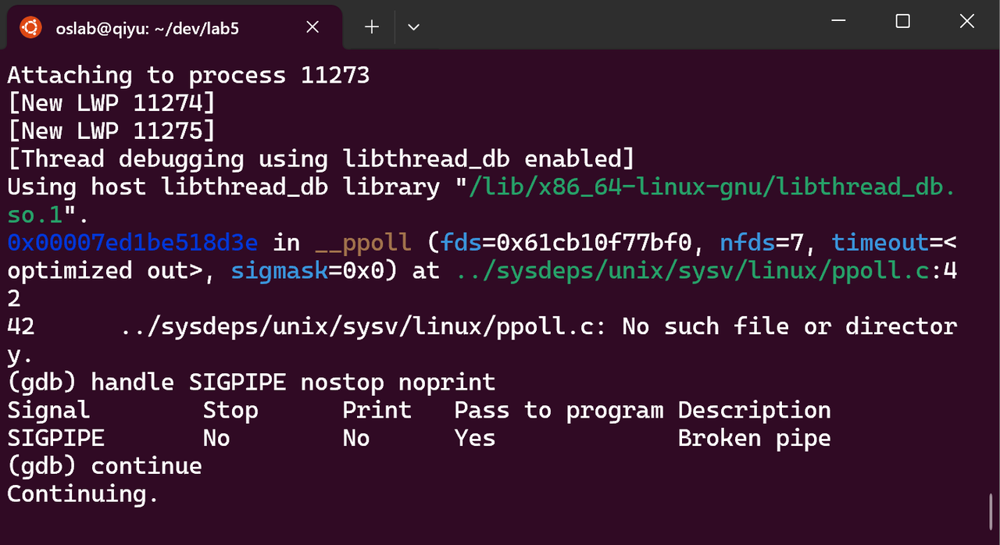

3. 在第三个终端启动GDB 调试ucore内核

   可以查看：

   ### &#x20;问题现象分析

   当执行：

   ```verilog
   (gdb) b user/libs/syscall.c:26
   ```

   出现：

   ```verilog
   No source file named user/libs/syscall.c.
   <future shared library load? (y or [n]) y
   Breakpoint 2 (user/libs/syscall.c:26) pending
   ```

   这表示：

   * GDB 当前加载的调试信息中没有用户程序的符号表和源代码信息

   * 只有内核的调试信息被加载了

   * `pending` 断点意味着：GDB 会记住这个断点，但只有在相应模块加载后才生效

   #### 为什么会出现这种情况？

   查看 `Makefile` 中的调试相关目标：

   ```verilog
   #通常是这样的
   debug:@$(OBJDUMP) -S $(KERNEL) > $(KERNEL).asm@$(OBJDUMP) -t $(KERNEL) | sed '1,/SYMBOL TABLE/d; s/ .* / /; /^$$/d' > $(KERNEL).sym$(V)$(QEMU) $(QEMUOPTS) -S -s -d in_asm -D qemu.log

   gdb:$(V)$(GDB) -q -x tools/gdbinit
   ```

   关键点：

   1. 内核符号表自动加载，这样只加载了内核 (`bin/kernel`) 的调试信息。

   2. 用户程序不同：用户程序是独立的ELF文件，如 `obj/__user_exit.out`，它们的符号表没有被自动加载。

   #### 用户程序的加载机制

   在 ucore 实验框架中：

   ```verilog
   // 用户程序被编译成独立的 ELF
   // 然后被转换为二进制数据嵌入内核
   unsigned char __user_hello_out[] = {0x7f, 0x45, 0x4c, 0x46, ... 
   // ELF 文件内容};
   // 内核启动时解析这些 ELF 并加载到用户地址空间
   ```

   两个关键地址空间：

   * 内核地址空间：`0xC0000000` 以上

   * 用户地址空间：`0x80000000` 开始

   #### 应该先告诉GDB有一个额外的可执行文件需要加载符号再自动

   ```sql
   (gdb) add-symbol-file obj/__user_exit.out
   add symbol table from file "obj/__user_exit.out"
   (y or n) y
   Reading symbols from obj/__user_exit.out...
   (gdb) break user/libs/syscall.c:18
   Breakpoint 1 at 0x8000f8: file user/libs/syscall.c, line 19.
   ```

   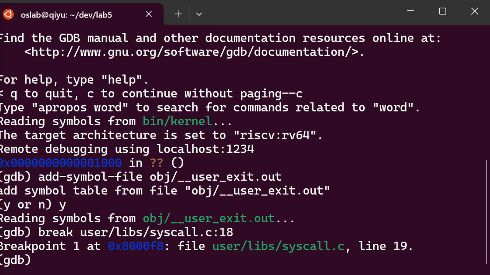

4. 加载后可以再用户空间代码里打断点，比如在syscall函数处

   1. GDB能够识别用户程序的源代码位置，0x8000f8是用户空间的地址

      ```verilog
      (gdb) break user/libs/syscall.c:18
      Breakpoint 1 at 0x8000f8: file user/libs/syscall.c, line 19.
      ```

   2. 开始单步执行一条指令，continue运行到断点，此刻停在用户空间的syscall函数

      1. 查看汇编代码x/7i $pc

         * `syscall+34`：正在准备系统调用参数

           * `ld a1,40(sp)`：加载第二个参数到寄存器 `a1`

           * 这是按照 RISC-V 调用约定准备参数

         * `ecall` 指令：`0x800104` 地址处

           * 这是从用户态切换到内核态的关键指令！

           * 执行后，CPU 会跳转到内核的异常处理入口

      2. 单步执行到ecall

         ```verilog
         (gdb) si    # 多次执行，直到到达 ecall
         ...
         (gdb) i r $pc
         pc    0x800104 0x800104 <syscall+44>
         ```

         * 现在程序计数器指向 `0x800104`，就是 `ecall` 指令的位置

         * 再执行一次 `si` 就会触发异常进入内核

   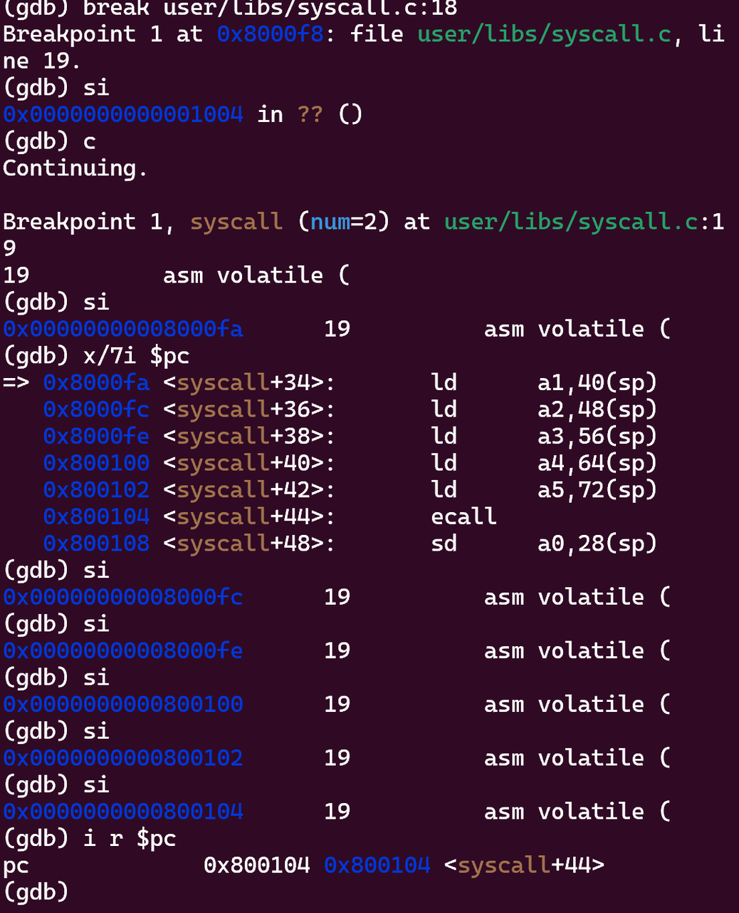

5. 重复在终端3执行si，发出ecall指令，此时

   1. guest 角度：CPU 执行 ecall

   2. QEMU 角度：把这条 ecall 翻译成 TCG 或执行已经翻译好的 TB&#x20;

   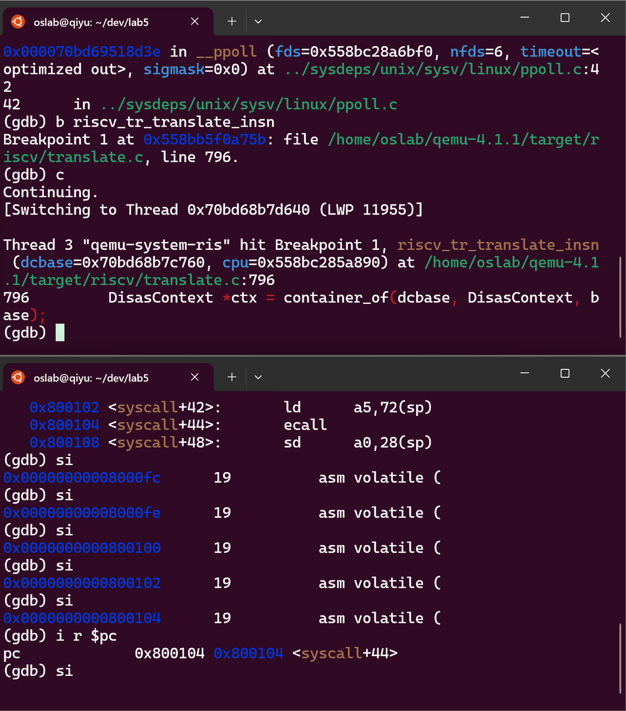

   ```verilog
   //终端2执行
   n
   n
   p/x ctx->base.pc_next
   n
   n
   p/x ctx->base.pc_next
   condition 1 ctx->base.pc_next==0x800104
   c
   //终端3显示
   0xffffffffc0200e5c in __alltraps () at kern/trap/trapentry.S:123
   123         SAVE_ALL
   ```

   * 终端2

     * QEMU正在翻译地址 `0x800104` 处的指令

     * 这正是Guest中`ecall`指令的位置（从前面知道 `0x800104` 是 `syscall+44` 处的 `ecall`）

     * 解码操作后，`pc_next` 仍然是 `0x800104`

     * QEMU已经识别出这是`ecall`指令

     * 设置条件断点：只在翻译 `0x800104` 地址的指令时触发

     * 继续执行

   * 终端3

     * Guest的PC正指向 `0x800104`（ecall指令）

     * 显示的是ecall之后的指令（`0x800108: sd a0,28(sp)`）

     执行`si`后：

     * 从 `0x800104`（用户空间）跳转到 `0xC0200e5c`（内核空间）

     * 进入了内核的异常处理入口 `__alltraps`

   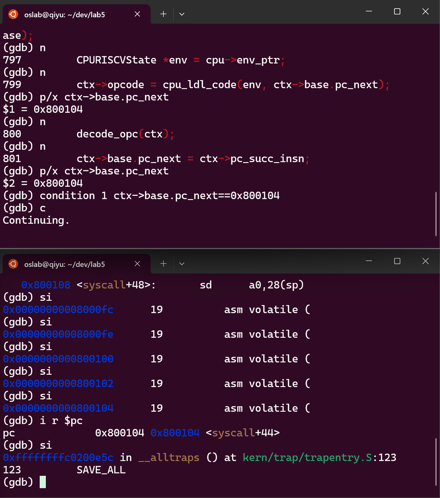

6. 终端3执行

   * 当前PC：`0xfffffffffc0200e5c`

     * 位置：内核的 `__alltraps` 函数（异常处理入口）

     * 地址格式：`0xfffffffff...` 是64位地址的高位扩展，实际上是 `0xC0200e5c`

   * sepc值：`0x800104`

     * 含义：当异常发生时，硬件自动将发生异常的指令地址保存到 `sepc`

     * 关键：这正是用户空间 `ecall` 指令的地址

   * scause值：`0x8`（十进制8）含义：异常原因代码

   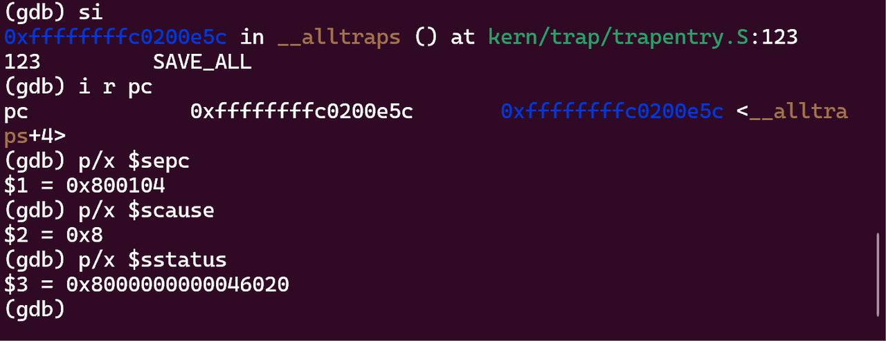

7. 终端3中设置断点 b \_\_trapret 并执行，查看反汇编指令

   ```verilog
   (gdb) b __trapret
   Breakpoint 2 at 0xffffffffc0200ec8: file kern/trap/trapentry.S, line 131.
   (gdb) c
   Continuing.

   Breakpoint 2, __trapret () at kern/trap/trapentry.S:131
   131         RESTORE_ALL
   (gdb) disassemble __trapret
   Dump of assembler code for function __trapret:
   => 0xffffffffc0200ec8 <+0>:     ld      s1,256(sp)
      0xffffffffc0200eca <+2>:     ld      s2,264(sp)
      0xffffffffc0200ecc <+4>:     andi    s0,s1,256
      0xffffffffc0200ed0 <+8>:     bnez    s0,0xffffffffc0200ed8 <__trapret+16>
      0xffffffffc0200ed2 <+10>:    addi    s0,sp,288
      0xffffffffc0200ed4 <+12>:    csrw    sscratch,s0
      0xffffffffc0200ed8 <+16>:    csrw    sstatus,s1
      0xffffffffc0200edc <+20>:    csrw    sepc,s2
      0xffffffffc0200ee0 <+24>:    ld      ra,8(sp)
      0xffffffffc0200ee2 <+26>:    ld      gp,24(sp)
      0xffffffffc0200ee4 <+28>:    ld      tp,32(sp)
      0xffffffffc0200ee6 <+30>:    ld      t0,40(sp)
      0xffffffffc0200ee8 <+32>:    ld      t1,48(sp)
      0xffffffffc0200eea <+34>:    ld      t2,56(sp)
   --Type <RET> for more, q to quit, c to continue without paging--
   ```

   继续直到看到sret

   #### 继续打详细断点b \*0xffffffffc0200f1e

   * 内核的 `__trapret` 函数（陷阱返回）

   * 指令：`sret` - 监管者模式返回指令

   * 作用：从异常/中断处理返回，恢复用户态执行

   ```verilog
      0xffffffffc0200f1e <+86>:    sret
   (gdb) b *0xffffffffc0200f1e
   Breakpoint 3 at 0xffffffffc0200f1e: file kern/trap/trapentry.S, line 133.
   (gdb) c
   Continuing.

   Breakpoint 3, __trapret () at kern/trap/trapentry.S:133
   133         sret
   ```

   ### 查看当前CSR

   #### sepc分析：

   * 值：`0x800108`

   * 变化：之前看到 `sepc = 0x800104`（ecall地址），现在变成了 `0x800108`

   * 原因：内核在异常处理过程中修改了sepc

   * 含义：`sret` 将返回到 `0x800108`（ecall的下一条指令）

   #### sstatus分析：

   * 值：`0x8000000000046020`

   * 解码（重点关注返回相关的位）：

     * `SPP = 0`：将返回到用户模式（U-mode）

     * `SPIE = 1`：返回后会使能监管者中断

     * `SIE = 0`：当前监管者中断禁用

   #### 返回地址修改

   为什么 `sepc` 从 `0x800104` 变成了 `0x800108`？

   原因：在系统调用处理过程中，内核通常会将 `sepc` 加4（对于32位指令）或加2（对于16位压缩指令），这样 `sret` 时会跳过 `ecall` 指令，继续执行下一条指令。

   #### 为什么查看sstatus失败？

   * 因为现在处于用户模式

   * GDB可能无法直接访问特权寄存器（如sstatus）

   * `E14` 错误表示权限不足

   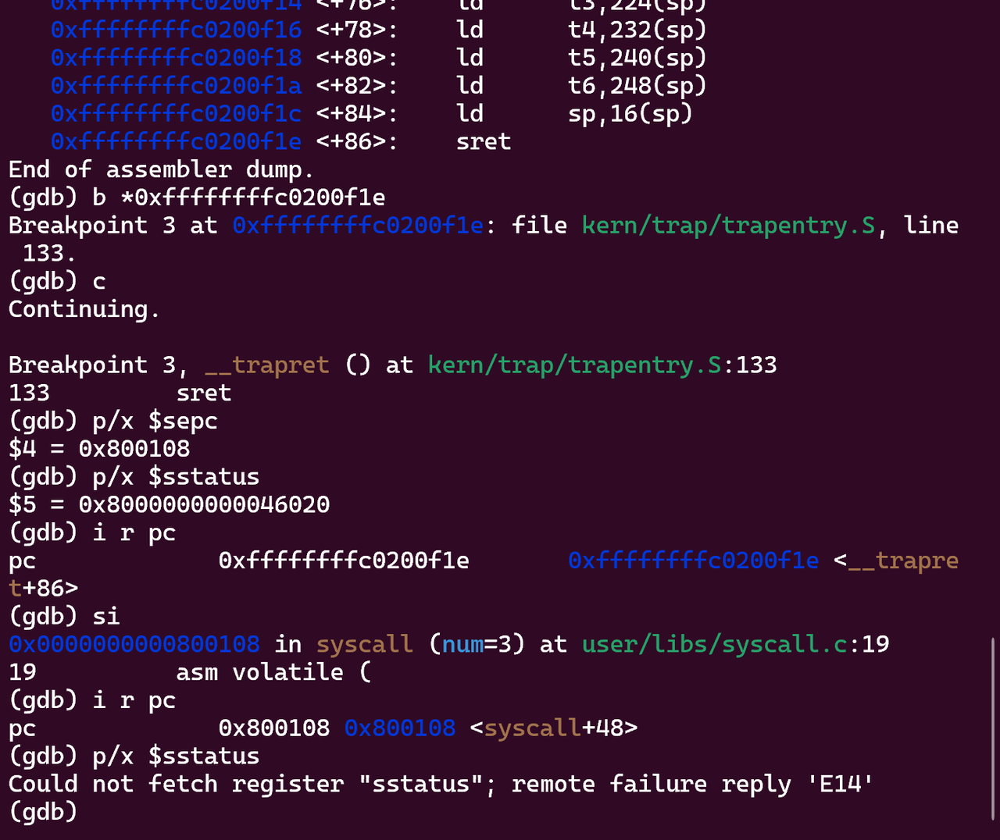

### 整体结果

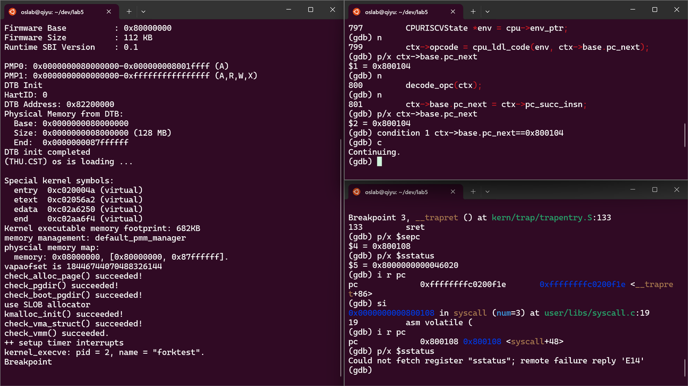

### TCG翻译机制分析

#### TCG（Tiny Code Generator）基本原理

TCG是QEMU的动态二进制翻译引擎，其工作流程如下：

```verilog
Guest指令 (RISC-V) → 前端解码 → TCG中间代码 → 后端优化 → Host指令 (x86-64)
```

#### ecall/sret的TCG翻译流程

1. 指令检测：QEMU在翻译块执行时检测到未翻译的指令

2. 前端翻译：`riscv_tr_translate_insn`识别`ecall`/`sret`指令

3. 中间代码生成：生成对应的TCG操作码和helper函数调用

4. 后端代码生成：将TCG中间代码转换为宿主架构的机器码

5. 执行翻译块：执行生成的代码，模拟指令语义

#### 翻译缓存（TB Cache）机制

有趣观察：在执行`sret`指令时，触发了翻译缓存的刷新

```verilog
//在QEMU调试中观察到
(gdb) b cpu_get_tb_cpu_state
(gdb) c
//执行sret后触发tb_flush，大量翻译块被刷新
```

原因分析：`sret`指令改变了CPU状态（特权级、中断使能等），导致之前缓存的翻译块失效，需要重新翻译。

### 关键发现与有趣细节

#### 特权级切换的精确时序

通过双重GDB调试，我们能够精确观察到特权级切换的时序：

1. ecall执行瞬间：用户模式→监管者模式切换

2. sret执行瞬间：监管者模式→用户模式切换

3. 硬件自动操作：CSR寄存器更新的精确时机

#### QEMU的异常模拟机制

发现QEMU通过`exception_index`机制模拟硬件异常：

```verilog
// 在QEMU调试中验证(gdb) p riscv_excp_names[8]
$1 = 0x558bb5f5a8c0 "u_ecall"

(gdb) p env->exception_index
$2 = 8  // RISCV_EXCP_U_ECALL
```

#### 系统调用参数传递的双重视角

用户视角：参数通过C函数调用约定传递

内核视角：参数从trapframe中提取

硬件视角：参数存储在通用寄存器中

### 大模型辅助调试记录

#### 解决的问题与交互过程

