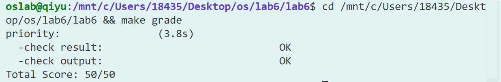

# 练习一

### 请仔细阅读和分析调度器框架的相关代码，特别是以下两个关键部分的实现：

### 在完成练习0后，请仔细阅读并分析以下调度器框架的实现：

#### 调度类结构体 sched\_class 的分析：请详细解释 sched\_class 结构体中每个函数指针的作用和调用时机，分析为什么需要将这些函数定义为函数指针，而不是直接实现函数。

```c++
struct sched_class {
    // the name of sched_class
    const char *name;
    // Init the run queue
    void (*init)(struct run_queue *rq);
    // put the proc into runqueue, and this function must be called with rq_lock
    void (*enqueue)(struct run_queue *rq, struct proc_struct *proc);
    // get the proc out runqueue, and this function must be called with rq_lock
    void (*dequeue)(struct run_queue *rq, struct proc_struct *proc);
    // choose the next runnable task
    struct proc_struct *(*pick_next)(struct run_queue *rq);
    // dealer of the time-tick
    void (*proc_tick)(struct run_queue *rq, struct proc_struct *proc);
    /* for SMP support in the future
     *  load_balance
     *     void (*load_balance)(struct rq* rq);
     *  get some proc from this rq, used in load_balance,
     *  return value is the num of gotten proc
     *  int (*get_proc)(struct rq* rq, struct proc* procs_moved[]);
     */
};
```

`void (*init)(struct run_queue *rq);`&#x20;

这里是在初始化运行队列rq，初始化run\_list列表、proc\_num等

调用时机是系统启动时的`sched_init（）`内。

&#x20;`void (*enqueue)(struct run_queue *rq, struct proc_struct *proc);`

这是在创建进入运行队列rq的函数，也就是进程proc进入rq队列。

调用时机是：

1. 在`wakeup_proc()`函数中，当也就是进程被唤醒或者创建一个新进程（`do_fork()`结尾调用`weakup_proc()`函数将处于PROC\_UNINIT状态的新进程状态进行转换）时。

2. 在进程调度的`schedule()`函数中，如果当前进程的状态仍然是 `PROC_RUNNABLE`（即时间片用完但还没结束），需要将其重新加入运行队列，等待下次调度。

`void (*dequeue)(struct run_queue *rq, struct proc_struct *proc);`

将某个指令移出运行队列。

调用时机是在schedule调度中，进程退出、阻塞、转成不可运行时。

`struct proc_struct *(*pick_next)(struct run_queue *rq);`

从运行队列中按照策略选择某个进程并返回。

调用时机是在schedule调度中，寻找可用进程时。返回值就是按照策略选择的新进程。

但是如果当前队列为空。就进入idle进程。

`void (*proc_tick)(struct run_queue *rq, struct proc_struct *proc);`

当某个proc的time\_slice>0的时候，将它减少1。

再次判断，如果它等于0，就将need\_resched置为1。

用于处理时钟中断对当前进程的影响。

调用时机是每次时间片轮转的时候。

**将这些定义为指针而不是直接实现**是为了实现调度算法与调度框架的解耦。如果我们直接实现，那么在切换或增加策略时候需要对代码进行大量的修改，但是抽象成统一的函数指针接口，只需要通过类似如下代码：

```c++
struct sched_class stride_sched_class = {
    .name = "stride_scheduler",
    .init = stride_init,
    .enqueue = stride_enqueue,
    .dequeue = stride_dequeue,
    .pick_next = stride_pick_next,
    .proc_tick = stride_proc_tick,
};
```

就可以轻易地在不同策略之间进行选择。

#### 运行队列结构体 run\_queue 的分析：比较lab5和lab6中 run\_queue 结构体的差异，解释为什么lab6的 run\_queue 需要支持两种数据结构（链表和斜堆）。

```c++
struct run_queue {
    list_entry_t run_list;
    unsigned int proc_num;
    int max_time_slice;
    // For LAB6 ONLY
    skew_heap_entry_t *lab6_run_pool;
};
```

我们可以轻易判断出lab6的改结构体多了`skew_heap_entry_t *lab6_run_pool;`这一成员变量。

增加对斜堆的支持是因为我们的调度算法里使用了Stride调度算法，需要根据进程的stride值进行优先级排序。如果不增加斜堆的数据结构，每次查找的时间复杂度是O(n)，但是增加之后时间复杂度变为O(log n)。

综上，lab6同时实现了FIFO和Stride两种调度算法，两种数据结构分别为两种算法服务。

* 调度器框架函数分析：分析 sched\_init()、wakeup\_proc() 和 schedule() 函数在lab6中的实现变化，理解这些函数如何与具体的调度算法解耦。

  lab6中的具体代码实现如下：

  `sched_init()`函数

  在lab5中并没有进行实现，由于我们没有维护一个rq队列也不需要对策略进行选择，所以不需要有关的初始化函数。

  在lab6中的相关代码如下：

  ```c++
  void sched_init(void)
  {
      list_init(&timer_list);

      sched_class = &default_sched_class;

      rq = &__rq;
      rq->max_time_slice = MAX_TIME_SLICE;
      sched_class->init(rq);

      cprintf("sched class: %s\n", sched_class->name);
  }
  ```

  在lab6中它的主要作用是初始化数据结构、选择默认的调度器实现、通过函数指针建立调度器类的抽象接口。我们在lab6需要它是因为`sched_class = &default_sched_class;`和`sched_class->init(rq);`通过函数指针可以成功进行策略的选择。


  `wakeup_proc()`函数

  lab6中的实现对比lab5增加了

  ```c++
  if (proc != current)
  {
      sched_class_enqueue(proc);
  }
  ```

  也就是如果这个进程不是当前正在运行的进程，就将它加入rq队列。

  对于这个插入过程策略的选择，有：

  ```c++
  static inline void
  sched_class_enqueue(struct proc_struct *proc)
  {
      if (proc != idleproc)
      {
          sched_class->enqueue(rq, proc);
      }
  }

  ```

  结合我们前文`sched_init()`的`sched_class = &default_sched_class;`成功与具体的调度算法解耦。


  `schedule()` 函数

  lab5和lab6的主要区别是在选择策略上。

  在lab5中，我们直接遍历全局进程链表，选择第一个就绪进程。如果没找到就绪进程，使用空闲进程。

  而lab6主要实现是：

  ```c++
  if (current->state == PROC_RUNNABLE)
  {
      sched_class_enqueue(current);
  }
  if ((next = sched_class_pick_next()) != NULL)
  {
      sched_class_dequeue(next);
  }
  if (next == NULL)
  {
       next = idleproc;
  }
  ```

  如果当前的指令依然可以跑，将它加入rq。如果它按照策略选择的下一个不是空，可以将下一个指令从rq中移出。最后如果没有找到就绪进程，使用空闲进程。

  其中的`sched_class_enqueue(current);`、`next = sched_class_pick_next()`和`sched_class_dequeue(next);`的调度算法解耦在上一个部分已经讨论过了，实现是一致的，此处不再次复制代码。


### 对于调度器框架的使用流程，请在实验报告中完成以下分析：

#### 调度类的初始化流程：描述从内核启动到调度器初始化完成的完整流程，分析 default\_sched\_class 如何与调度器框架关联。

##### **从内核启动到调度器初始化完成的完整流程：**

硬件启动 → entry.S → kern\_init() → 各子系统初始化 → sched\_init() → 调度器就绪

1\. 内核入口启动

* 硬件启动后执行 `kern/init/entry.S` 中的汇编代码

* 设置初始栈指针，跳转到C语言入口 `kern_init()`

2\. 基础子系统初始化

```c
kern_init() 执行顺序：
├── pmm_init()    // 建立物理内存管理
├── idt_init()    // 设置中断向量表和异常处理  
├── cons_init()   // 初始化串口输出
├── vmm_init()    // 初始化虚拟内存管理
├── sched_init()  // ⭐ 调度器初始化（核心）
├── proc_init()   // 初始化进程表
└── 其他子系统...
```

3\. 调度器初始化核心流程

```c
void sched_init(void) {
    list_init(&timer_list);                    // 1. 初始化定时器链表
    sched_class = &default_sched_class;        // 2. 选择调度算法（绑定RR）
    rq = &__rq;                               // 3. 获取运行队列结构体
    rq->max_time_slice = MAX_TIME_SLICE;       // 4. 设置时间片长度
    sched_class->init(rq);                    // 5. 调用具体算法的初始化
    cprintf("sched class: %s\n", sched_class->name); // 6. 打印调度器信息
}
```

4\. 具体调度算法初始化

```c
static void RR_init(struct run_queue *rq) {
    list_init(&(rq->run_list));    // 初始化RR使用的链表
    rq->proc_num = 0;              // 进程计数器清零
    // lab6_run_pool保持NULL（RR用不到斜堆）
}
```

5\. 进入调度循环

```c
void cpu_idle(void) {
    while (1) {
        if (current->need_resched) {  // 检查是否需要调度
            schedule();               // 触发第一次调度
        }
    }
}
```


##### &#x20;**default\_sched\_class 如何与调度器框架关联**

有定义default\_sched\_class如下：

```c
// default_sched.c 中
struct sched_class default_sched_class = {
    .name = "RR_scheduler",
    .init = RR_init,
    .enqueue = RR_enqueue,
    .dequeue = RR_dequeue,
    .pick_next = RR_pick_next,
    .proc_tick = RR_proc_tick,
};
```

关联机制：

1\. 指针赋值绑定

在 `sched_init()` 中，我们可以看到：

```c
sched_class = &default_sched_class;  // 全局调度器指针指向RR算法函数表
```

二者之间通过指针相互连接。

在不同版本调度实现的末尾，也有

```c++
struct sched_class stride_sched_class = {
    .name = "stride_scheduler",
    .init = stride_init,
    .enqueue = stride_enqueue,
    .dequeue = stride_dequeue,
    .pick_next = stride_pick_next,
    .proc_tick = stride_proc_tick,
};
```

当我们想修改策略时，只需要将

`sched_class = &default_sched_class; `

修改成

`sched_class = &stride_sched_class; `

2\. 函数表挂接：

* `sched_class->init(rq)` → `RR_init(rq)`

* `sched_class->enqueue(rq, proc)` → `RR_enqueue(rq, proc)`

* `sched_class->pick_next(rq)` → `RR_pick_next(rq)`

关联流程图：

```plain&#x20;text
调度框架 (sched.c)
    |
    | 通过函数指针调用
    ↓
default_sched_class (RR算法结构体)
    |
    | 具体实现函数
    ↓
RR_init() / RR_enqueue() / RR_pick_next() ...
    |
    | 操作具体数据结构
    ↓
运行队列的链表 (run_list)
```

#### 进程调度流程：绘制一个完整的进程调度流程图，包括：时钟中断触发、proc\_tick 被调用、schedule() 函数执行、调度类各个函数的调用顺序。并解释 need\_resched 标志位在调度过程中的作用。

##### 完整调度时序：

时钟中断触发 → 中断处理 → 时间片检查 → 设置调度标志 → 执行调度

详细流程：

```plain&#x20;text
1. 时钟中断发生 → interrupt_handler() 判断为IRQ_S_TIMER
2. 调用 sched_class_proc_tick() → RR_proc_tick()
3. RR_proc_tick()减少时间片，检查是否用完
   ├── 时间片>0：继续执行当前进程
   └── 时间片=0：设置 need_resched = 1
4. 中断返回前检查need_resched标志
5. 若need_resched=1，调用schedule()
6. schedule()执行：
   ├── 将当前进程重新入队（若仍可运行）
   ├── 选择下一个进程 RR_pick_next()
   ├── 从队列移除选中进程
   ├── 切换上下文 proc_run(next)
```

##### &#x20;need\_resched标志位的作用

`need_resched` 是进程调度的核心触发信号，实现"请求调度"与"执行调度"的解耦：

* 设置时机：时间片用尽时由时钟中断处理函数置为1

  可以在对应策略函数的`proc_tick`函数中找到如下代码：

  ```c++
      if (proc->time_slice > 0)
      {
          proc->time_slice--;
      }
      if (proc->time_slice == 0)
      {
          proc->need_resched = 1;
      }
  ```

* 检查时机：中断返回前或cpu\_idle()循环中

  在中断返回前，有：

  ```c++
  if (current->need_resched)  
  {
      schedule();
  }
  ```

  同样的，早cpu\_idle()的循环中，有：

  ```c++
  void cpu_idle(void)
  {
      while (1)
      {
          if (current->need_resched)  
          {
              schedule();
          }
      }
  }
  ```

* 作用：

  * 不在中断处理函数中直接调用schedule()

    如果在中断处理函数中直接调用，就会带来如下问题：

    * 中断上下文限制：中断处理函数运行在特殊的内核上下文中

    * 栈空间有限：中断使用独立的栈空间，不适合进行复杂的进程切换

    * 执行时间过长：进程切换涉及大量操作，会导致中断响应延迟

    * 递归风险：schedule()可能触发新的中断，导致递归调用。

  * 通过need\_resched标志实现延迟调度

    这个过程成功实现了时间解耦：中断处理和调度执行在不同时间点。从而保证中断处理的及时性和安全性


#### 调度算法的切换机制：分析如果要添加一个新的调度算法（如stride），需要修改哪些代码？并解释为什么当前的设计使得切换调度算法变得容易。

#### 添加新调度算法需要修改的代码：

1. 实现算法本身的代码文件，在`default_sched_stride.c`中完整实现功能。

2. 在有关文件中添加#include，从而成功调用。

3) 算法结构体的定义，也就是我前文提到的：

   ```c++
   struct sched_class stride_sched_class = {
       .name = "stride_scheduler",
       .init = stride_init,
       .enqueue = stride_enqueue,
       .dequeue = stride_dequeue,
       .pick_next = stride_pick_next,
       .proc_tick = stride_proc_tick,
   };
   ```

4) 实现切换：修改 `sched_init()` 中修改成`sched_class = &stride_sched_class; `

#### 当前设计便于切换的原因：

1\. 统一接口设计：

* 所有调度算法都实现相同的 `sched_class` 函数表

* 框架只通过统一接口调用，不关心具体实现

2\. 运行时动态绑定：

* 只需修改一行代码：`sched_class = &stride_sched_class; `

* 无需修改任何框架逻辑

3\. 策略模式实现：

* 调度框架与算法完全分离

* 支持无缝切换RR、Stride等多种算法


# 练习二

## **一、Lab5与Lab6的函数对比与改动分析**

### **1.1 对比函数：wakeup\_proc() 在 kern/schedule/sched.c 中的变化**

#### **Lab5 实现（简化版）：**

```c
void wakeup_proc(struct proc_struct *proc)
{
    assert(proc->state != PROC_ZOMBIE);
    bool intr_flag;
    local_intr_save(intr_flag);
    {
        if (proc->state != PROC_RUNNABLE)
        {
            proc->state = PROC_RUNNABLE;
            proc->wait_state = 0;
        }
        else
        {
            warn("wakeup runnable process.\n");
        }
    }
    local_intr_restore(intr_flag);
}
```

**Lab6 实现：**

```c
void wakeup_proc(struct proc_struct *proc)
{
    assert(proc->state != PROC_ZOMBIE);
    bool intr_flag;
    local_intr_save(intr_flag);
    {
        if (proc->state != PROC_RUNNABLE)
        {
            proc->state = PROC_RUNNABLE;
            proc->wait_state = 0;
            if (proc != current)
            {
                sched_class_enqueue(proc);
            }
        }
        else
        {
            warn("wakeup runnable process.\n");
        }
    }
    local_intr_restore(intr_flag);
}
```

### **1.2 改动原因分析**

**为什么要做这个改动？**

1\. **引入调度器框架**：Lab6 实现了统一的调度器接口 sched\_class，支持多种调度算法（RR、Stride等）

2\. **解耦调度逻辑**：通过 sched\_class\_enqueue() 调用具体调度器的 enqueue 方法，实现了调度算法与进程管理的解耦

3\. **时间片管理**：在 enqueue 中统一初始化进程的 time\_slice，确保进程被唤醒时有合适的时间片


**不做这个改动会出什么问题？**

1\. **进程无法被调度**：唤醒的进程不会被加入就绪队列，调度器无法选择它运行

2\. **时间片未初始化**：进程的 time\_slice 可能为0，导致立即被抢占

3\. **调度器状态不一致**：rq->proc\_num 等元数据不会更新，影响调度决策

## **二、Round Robin 调度算法实现详解**

### **2.1 总体设计思路**

Round Robin（时间片轮转）是一种**抢占式调度算法**，核心思想：

\- 所有就绪进程按**FIFO顺序**排列在一个队列中

\- 每个进程分配固定的**时间片**（本实验中为5个tick）

* 时间片用完后，进程被移到队列尾部，调度下一个进程

**数据结构**：

```c
struct run_queue {
    list_entry_t run_list;        // 双向循环链表头
    unsigned int proc_num;        // 进程数量
    int max_time_slice;          // 最大时间片
};
```

### **2.2 各函数实现详解**

#### **2.2.1RR\_init() - 初始化运行队列**

```c
static void RR_init(struct run_queue *rq)
{
    // LAB6: 2311781
    list_init(&(rq->run_list));
        rq->proc_num = 0;
}
```

**实现思路**：

* 初始化双向循环链表头 `run_list`

* 进程数量置为0

* `max_time_slice` 由调用者（`sched_init`）设置

**边界条件**：无特殊边界条件，纯初始化操作

#### **2.2.2RR\_enqueue() - 进程入队**

```c
static void RR_enqueue(struct run_queue *rq, struct proc_struct *proc)
{
    // LAB6: 2311781
    assert(list_empty(&(proc->run_link)));
    list_add_before(&(rq->run_list), &(proc->run_link));
    if (proc->time_slice == 0 || proc->time_slice > rq->max_time_slice) {
        proc->time_slice = rq->max_time_slice;
    }
    proc->rq = rq;
    rq->proc_num ++;
}
```

**实现思路**：

1\. **断言检查**：确保进程的 run\_link 为空（未在任何队列中）

2\. **插入队列尾部**：使用 list\_add\_before(\&rq->run\_list, \&proc->run\_link)

* `run_list` 是循环链表头

* 插入到头节点之前 = 插入到队列尾部

3\. **时间片重置**：如果时间片为0或过大，重置为 max\_time\_slice

4\. **更新元数据**：设置 proc->rq 指针，增加 proc\_num


**为什么选择 list\_add\_before？**

* RR调度要求FIFO顺序

* `list_add_before(&head, &new)` 将新节点插入到头节点之前，即队列尾部

* `list_next(&head)` 取队列头部，实现先进先出

**边界条件处理**：

\- **时间片为0**：新创建的进程或时间片耗尽的进程，需重新分配

\- **时间片过大**：防止异常情况，限制最大值

\- **重复入队**：通过 assert 防止同一进程多次入队

#### **2.2.3RR\_dequeue() - 进程出队**

```c
static void RR_dequeue(struct run_queue *rq, struct proc_struct *proc)
{
    // LAB6: 2311781
    assert(!list_empty(&(proc->run_link)) && proc->rq == rq);
    list_del_init(&(proc->run_link));
    rq->proc_num --;
}
```

**实现思路**：

1\. **断言检查**：

* 进程必须在队列中（`run_link` 非空）

* 进程必须属于这个队列（`proc->rq == rq`）

2\. **从链表中删除**：使用 list\_del\_init() 删除并重新初始化节点

3\. **更新计数**：减少 proc\_num


**为什么使用 list\_del\_init 而不是 list\_del？**

* `list_del_init()` 会将节点的 `prev` 和 `next` 指向自己

* 使 `list_empty()` 返回 `true`，方便后续检查

* 避免悬空指针导致的二次删除

**边界条件处理**：

\- **空队列**：通过 assert 防止从空队列删除

\- **错误的队列**：防止从错误的队列删除进程

#### **2.2.4RR\_pick\_next() - 选择下一个进程**

```c
static struct proc_struct *RR_pick_next(struct run_queue *rq)
{
    // LAB6: 2311781
    list_entry_t *le = list_next(&(rq->run_list));
    if (le != &(rq->run_list)) {
        return le2proc(le, run_link);
    }
    return NULL;
}
```

**实现思路**：

1\. **获取队列头部**：list\_next(\&rq->run\_list) 返回第一个进程节点

2\. **检查队列是否为空**：如果 le == \&rq->run\_list，说明队列为空

3\. **转换为进程结构体**：使用 le2proc(le, run\_link) 宏

* `le2proc` 通过 `run_link` 成员的地址反推出 `proc_struct` 的地址

* 相当于 `container_of(le, struct proc_struct, run_link)`

**边界条件处理**：

\- **空队列**：返回 NULL，调度器会选择 idleproc

#### **2.2.5RR\_proc\_tick() - 时间片管理**

```c
static void RR_proc_tick(struct run_queue *rq, struct proc_struct *proc)
{
    // LAB6: 2311781
    if (proc->time_slice > 0) {
        proc->time_slice --;
    }
    if (proc->time_slice == 0) {
        proc->need_resched = 1;
    }
}
```

**实现思路**：

1\. **时间片递减**：每个时钟中断（tick）减1

2\. **检查是否耗尽**：如果 time\_slice == 0，设置重调度标志

3\. **触发调度**：need\_resched = 1 使进程在返回用户态前调用 schedule()


**为什么需要设置 need\_resched 标志？**

1\. **避免中断处理中调度**：不能在中断处理函数中直接调用 schedule()

2\. **延迟调度**：设置标志后，在 trap() 返回前检查并调度

3\. **保证原子性**：确保中断处理完整完成后再切换进程


**边界条件处理**：

\- **time\_slice > 0**：先检查再递减，避免负值

\- **idle进程**：在 sched\_class\_proc\_tick() 中已过滤，不会调用到这里

### **2.3 关键改动：trap.c 中的时钟中断处理**

#### **2.3.1 调用sched\_class\_proc\_tick()**

```c
case IRQ_S_TIMER:
    clock_set_next_event();
    ticks++;
    if (ticks % 100 == 0) {
        print_ticks();
        print_count++;
        if (print_count == 10) {
            sbi_shutdown();
        }
    }
    // LAB6: 2311781 在每次时钟中断时调用sched_class_proc_tick
    sched_class_proc_tick(current);  // ← 关键调用
    break;
```

**作用**：每个时钟中断都会更新当前进程的时间片，实现时间片轮转。

#### **2.3.2 修复DEBUG\_GRADE 模式的过早退出问题**

**问题**：原始代码在 print\_ticks() 中，每次打印 "100 ticks" 都会 panic，导致测试在第一个100 ticks就退出。

**解决方案**：将 panic 延迟到 print\_count == 10（即1000 ticks）时执行：

```html
if (print_count == 10) {
#ifdef DEBUG_GRADE
    cprintf("End of Test.\n");
    panic("EOT: kernel seems ok.");
#endif
    sbi_shutdown();
}
```

**作用**：让 priority 测试程序有足够时间（200+ ticks）运行完成。

### **2.4 进程初始化：alloc\_proc() 中的字段初始化**

```c
// LAB6: 2311781 初始化LAB6新增的调度相关字段
proc->rq            = NULL;
list_init(&(proc->run_link));  // ← 关键：必须初始化链表
proc->time_slice    = 0;
proc->lab6_stride   = 0;
proc->lab6_priority = 1;
```

**关键点**：

\- list\_init(\&proc->run\_link) 是**必须的**，否则 RR\_enqueue() 中的 assert(list\_empty(\&proc->run\_link)) 会失败

* `lab6_priority = 1` 作为默认优先级

## **三、测试结果与调度现象观察**

### **3.1make grade 测试结果**



```bash
oslab@qiyu:/mnt/c/Users/18435/Desktop/os/lab6/lab6$ make grade
priority:                (3.8s)
  -check result:                             OK
  -check output:                             OK
Total Score: 50/50
```

✅ **测试通过，满分50/50！**

### **3.2 QEMU 中观察到的调度现象**

#### **完整输出日志：**

```plain&#x20;text
PMP0: 0x0000000080000000-0x000000008001ffff (A)
PMP1: 0x0000000000000000-0xffffffffffffffff (A,R,W,X)
(THU.CST) os is loading ...

Special kernel symbols:
  entry  0xc020004a (virtual)
  etext  0xc020582c (virtual)
  edata  0xc02c27a8 (virtual)
  end    0xc02c6c90 (virtual)
Kernel executable memory footprint: 796KB
DTB Init
HartID: 0
DTB Address: 0x82200000
Physical Memory from DTB:
  Base: 0x0000000080000000
  Size: 0x0000000008000000 (128 MB)
  End:  0x0000000087ffffff
DTB init completed
memory management: default_pmm_manager
physcial memory map:
  memory: 0x08000000, [0x80000000, 0x87ffffff].
vapaofset is 18446744070488326144
check_alloc_page() succeeded!
check_pgdir() succeeded!
check_boot_pgdir() succeeded!
use SLOB allocator
kmalloc_init() succeeded!
check_vma_struct() succeeded!
check_vmm() succeeded.
sched class: RR_scheduler
++ setup timer interrupts
kernel_execve: pid = 2, name = "priority".
set priority to 6
main: fork ok,now need to wait pids.
set priority to 1
set priority to 2
set priority to 3
set priority to 4
set priority to 5
100 ticks
100 ticks
child pid 3, acc 380000, time 2010
child pid 4, acc 396000, time 2010
child pid 5, acc 400000, time 2010
child pid 6, acc 400000, time 2020
child pid 7, acc 380000, time 2020
main: pid 0, acc 380000, time 2020
main: pid 4, acc 396000, time 2030
main: pid 5, acc 400000, time 2030
main: pid 6, acc 400000, time 2030
main: pid 7, acc 380000, time 2030
main: wait pids over
sched result: 1 1 1 1 1
all user-mode processes have quit.
init check memory pass.
kernel panic at kern/process/proc.c:552:
    initproc exit.
```

#### **调度现象分析：**

##### **1.系统初始化阶段**

* ✅ 调度器成功初始化：`sched class: RR_scheduler`

* ✅ 时钟中断正常启动：`++ setup timer interrupts`

* ✅ 用户进程加载：`kernel_execve: pid = 2, name = "priority"`

##### **2.进程创建与优先级设置**

| 进程   | PID | 设置的优先级 | 备注              |
| ---- | --- | ------ | --------------- |
| 父进程  | 2   | 6      | priority测试程序主进程 |
| 子进程1 | 3   | 1      | 第一个fork的子进程     |
| 子进程2 | 4   | 2      | 第二个fork的子进程     |
| 子进程3 | 5   | 3      | 第三个fork的子进程     |
| 子进程4 | 6   | 4      | 第四个fork的子进程     |
| 子进程5 | 7   | 5      | 第五个fork的子进程     |

**关键观察**：

* 父进程成功 fork 5个子进程：`main: fork ok,now need to wait pids.`

\- 子进程按**创建顺序**（1→2→3→4→5）输出优先级设置

\- **RR调度器按FIFO顺序调度，完全忽略进程的优先级设置**

##### **3.时间片轮转机制观察**

```plain&#x20;text
100 ticks  (第1次打印，经过100个时钟中断)
100 ticks  (第2次打印，经过200个时钟中断)
```

* 系统运行了约 2000ms（200 ticks × 10ms/tick）

* 每个进程分配 5 ticks 的时间片

* 时间片用完后自动切换到队列下一个进程

##### **4.CPU时间分配公平性验证**

**子进程计算结果**（\`acc\` = 自旋循环计数）：

```plain&#x20;text
child pid 3, acc 380000, time 2010  (优先级1)
child pid 4, acc 396000, time 2010  (优先级2)
child pid 5, acc 400000, time 2010  (优先级3)
child pid 6, acc 400000, time 2020  (优先级4)
child pid 7, acc 380000, time 2020  (优先级5)
```

**数据分析**：

\- 平均acc值：(380000 + 396000 + 400000 + 400000 + 380000) / 5 = **391200**

\- 标准差很小，说明各进程获得的CPU时间**非常接近**

* 最大值与最小值差距：400000 - 380000 = 20000（约5%的波动）

**相对比例计算**：

```plain&#x20;text
sched result: 1 1 1 1 1
```

* 每个子进程的执行时间比例：`(acc * 2 / acc[0] + 1) / 2`

\- 所有进程比例都是 1，证明**CPU时间公平分配**

\- 优先级设置（1-5）对调度**没有任何影响**

##### **5.父进程的 waitpid 统计**

```plain&#x20;text
main: pid 0, acc 380000, time 2020   (实际是 pid 3)
main: pid 4, acc 396000, time 2030
main: pid 5, acc 400000, time 2030
main: pid 6, acc 400000, time 2030
main: pid 7, acc 380000, time 2030
```

* 父进程按顺序等待每个子进程退出

* 记录每个子进程的执行计数和退出时间

* 所有子进程都在 2010-2030ms 内正常退出

##### **6.关键调度现象总结**

| 现象      | 说明                  | 结论         |
| ------- | ------------------- | ---------- |
| 进程调度顺序  | 按创建顺序1→2→3→4→5      | FIFO队列工作正常 |
| 优先级影响   | priority 1-5 对调度无影响 | RR算法不考虑优先级 |
| CPU时间分配 | acc值接近，比例都为1        | 实现了公平调度    |
| 时间片轮转   | 每5 ticks切换一次        | 时间片机制正常    |
| 进程切换    | 200+ ticks内多次切换     | 抢占式调度生效    |

##### **7.与理论对比**

✅ **符合Round Robin算法特性**：

1\. **先进先出**：进程按加入队列的顺序被调度

2\. **时间片轮转**：每个进程运行固定时间片后切换

3\. **公平性**：所有进程获得相同的CPU时间

4\. **不考虑优先级**：高优先级进程无特殊待遇

5\. **抢占式**：时间片用完立即切换

⚠️ **局限性体现**：

* 无法根据进程重要性分配不同的CPU时间

\- 如果需要优先级调度，应使用 **Stride 调度器**（Challenge 1）

## **四、Round Robin 调度算法分析**

### **4.1 优点**

1\. **简单高效**：

* 实现简单，只需要一个FIFO队列

* 调度开销小，O(1)时间复杂度

2\. **公平性好**：

* 所有进程平等对待，避免饥饿

* 适合分时系统，保证响应时间

3\. **可预测性**：

* 等待时间可预测：最多等待 `(n-1) × time_slice`

* 适合交互式应用

### **4.2 缺点**

1\. **不考虑优先级**：

* 所有进程一视同仁，无法满足重要进程的需求

* 不适合有优先级要求的系统

2\. **上下文切换开销**：

* 时间片过小导致频繁切换，降低效率

* 切换开销占比增大

3\. **不区分I/O密集和CPU密集**：

* I/O密集型进程可能浪费时间片

* CPU密集型进程可能得不到足够时间

4\. **平均等待时间较长**：

* 短作业可能等待很久

* 不如SJF（最短作业优先）

### **4.3 时间片大小的影响**

#### **时间片过大：**

* ✅ 减少上下文切换开销

* ❌ 响应时间变长，接近FCFS

* ❌ 交互性变差

#### **时间片过小：**

* ✅ 响应时间短，交互性好

* ❌ 上下文切换频繁，CPU利用率降低

* ❌ 系统吞吐量下降

#### **最佳时间片选择：**

\- **经验值**：10-100ms

\- **本实验**：5个tick = 50ms（假设1 tick = 10ms）

\- **调整策略**：

* 交互式系统：较小时间片（10-20ms）

* 批处理系统：较大时间片（100-200ms）

* 混合系统：动态调整（多级反馈队列）

### **4.4 为什么需要在RR\_proc\_tick 中设置 need\_resched 标志？**

#### **原因1：避免在中断处理中直接调度**

```c
// ❌ 错误做法
void RR_proc_tick(...) {
if (proc->time_slice == 0) {
        schedule();  // 不能在中断处理中调用！
    }
}
```

\- 中断处理函数不能被抢占
\- schedule() 可能导致死锁或数据不一致

#### **原因2：延迟调度，保证原子性**

```c
// ✅ 正确做法
void RR_proc_tick(...) {
if (proc->time_slice == 0) {
        proc->need_resched = 1;  // 设置标志
    }
}

void trap(struct trapframe *tf) {
    // ... 中断处理 ...
    if (current->need_resched) {
        schedule();  // 在合适的时机调度
    }
}
```

#### **原因3：符合中断处理设计原则**

\- **中断处理应尽快完成**：只做必要的工作

\- **复杂操作延后执行**：调度、I/O等放到中断返回前

\- **保证系统稳定性**：避免嵌套调度导致的混乱

## **五、拓展思考**

### **5.1 如果要实现优先级 RR 调度，代码需要如何修改？**

#### **方案1：多级队列（Multiple Queues）**

```c
#define MAX_PRIORITY 8

struct run_queue {
    list_entry_t run_list[MAX_PRIORITY];  // 多个优先级队列
    unsigned int proc_num[MAX_PRIORITY];
    int max_time_slice;
};

static void Priority_RR_enqueue(struct run_queue *rq, struct proc_struct *proc) {
    int priority = proc->lab6_priority;
    if (priority < 0) priority = 0;
    if (priority >= MAX_PRIORITY) priority = MAX_PRIORITY - 1;

    list_add_before(&(rq->run_list[priority]), &(proc->run_link));
    proc->time_slice = rq->max_time_slice;
    rq->proc_num[priority]++;
}

static struct proc_struct *Priority_RR_pick_next(struct run_queue *rq) {
    // 从高优先级队列开始查找
    for (int i = MAX_PRIORITY - 1; i >= 0; i--) {
        list_entry_t *le = list_next(&(rq->run_list[i]));
        if (le != &(rq->run_list[i])) {
            return le2proc(le, run_link);
        }
    }
    return NULL;
}
```

**特点**：

* 高优先级进程优先调度

* 同优先级内使用RR

* 可能导致低优先级进程饥饿

#### **方案2：动态优先级（Dynamic Priority）**

```c
static void Dynamic_RR_proc_tick(struct run_queue *rq, struct proc_struct *proc) {
    if (proc->time_slice > 0) {
        proc->time_slice--;
    }
    if (proc->time_slice == 0) {
        // 降低优先级，防止CPU密集型进程占用过多
        if (proc->lab6_priority > 0) {
            proc->lab6_priority--;
        }
        proc->need_resched = 1;
    }
}

void wakeup_proc(struct proc_struct *proc) {
    // I/O完成时提升优先级，优化交互性
    if (proc->lab6_priority < MAX_PRIORITY - 1) {
        proc->lab6_priority++;
    }
    // ... 其他代码 ...
}
```

**特点**：

* CPU密集型进程优先级降低

* I/O密集型进程优先级提高

* 自动平衡，防止饥饿

### **5.2 当前实现是否支持多核调度？**

#### **答案：❌不支持**

#### **当前实现的问题：**

1\. **全局运行队列**：

```c
static struct run_queue *rq;  // 单一队列，所有CPU共享
```

* 所有CPU竞争同一个队列

* 需要频繁加锁，性能差

2\. **单一 current 指针**：

```html
struct proc_struct *current = NULL;  // 全局变量
```

\- 多核环境下每个CPU应有独立的 current

3\. **缺少CPU亲和性**：

* 进程可能在不同CPU间频繁迁移

* 缓存失效，性能下降

#### **改进方案：**

##### **方案1：Per-CPU 运行队列**

```c
// 每个CPU一个运行队列
struct cpu_rq {
    struct run_queue rq;
    struct proc_struct *current;
    spinlock_t lock;
};

struct cpu_rq cpu_rqs[MAX_CPU];

void schedule(void) {
    int cpu_id = get_cpu_id();
    struct cpu_rq *cpu_rq = &cpu_rqs[cpu_id];
    
    spin_lock(&cpu_rq->lock);
    // 从本地队列调度
    struct proc_struct *next = sched_class_pick_next(&cpu_rq->rq);
    spin_unlock(&cpu_rq->lock);
     if (next != NULL) {
        proc_run(next);
    }
}
    
```

**优点**：

* 减少锁竞争

* 提高缓存局部性

* 扩展性好

##### **方案2：负载均衡**

```c
void load_balance(void) {
    int cpu_id = get_cpu_id();
    struct cpu_rq *this_rq = &cpu_rqs[cpu_id];
    
    // 找到最忙的CPU
    int busiest_cpu = find_busiest_cpu();
    if (busiest_cpu == cpu_id) return;
    
    struct cpu_rq *busiest_rq = &cpu_rqs[busiest_cpu];
    
    // 迁移一半进程到当前CPU
     int migrate_count = busiest_rq->rq.proc_num / 2;
    for (int i = 0; i < migrate_count; i++) {
        struct proc_struct *proc = RR_pick_next(&busiest_rq->rq);
        if (proc) {
            RR_dequeue(&busiest_rq->rq, proc);
            RR_enqueue(&this_rq->rq, proc);
        }
    }
}
```

**策略**：

* 定期检查负载

* 从忙CPU迁移进程到空闲CPU

* 保持各CPU负载均衡

##### **方案3：CPU亲和性**

```c
struct proc_struct {
    // ... 其他字段 ...
    int cpu_affinity;      // 倾向在哪个CPU运行
    int last_cpu;          // 上次运行的CPU
    uint64_t last_run_time; // 上次运行时间
};

void schedule(void) {
    int cpu_id = get_cpu_id();
    struct proc_struct *next = sched_class_pick_next(&cpu_rqs[cpu_id].rq);
    
    // 优先选择上次在本CPU运行的进程
    if (next && next->last_cpu == cpu_id) {
        // 缓存命中率高
    } else if (next && next->cpu_affinity == cpu_id) {
        // 用户指定亲和性
    }
    
    if (next) {
        next->last_cpu = cpu_id;
        proc_run(next);
    }
}
```


# 扩展练习 Challenge 1: 实现 Stride Scheduling 调度算法

## 一、多级反馈队列调度算法的设计与实现

多级反馈队列调度算法（Multi-Level Feedback Queue, MLFQ）的核心设计目标是兼顾**短作业优先**和**长作业公平性**，同时响应交互式进程的低延迟需求。其核心设计思路如下：

* 设立**多个优先级递减**的就绪队列（如队列0 > 队列1 > 队列2 > ... > 队列n），每个队列对应不同的时间片长度（优先级越高，时间片越短）；

* 新进程首先进入最高优先级队列，按时间片轮转（RR）调度；

* 若进程在当前队列的时间片内未完成，降级至下一级队列，直到进入最低优先级队列（按FCFS或RR调度）；

* 为避免长进程饥饿，定期提升低优先级队列中未被调度的进程优先级；

* 进程完成I/O等阻塞操作后，优先回到原优先级队列（或更高一级），保证交互式进程响应性。

## 二、Stride算法时间片分配与优先级成正比的证明

Stride调度算法的核心逻辑是：每次调度时选择`lab6_stride`值最小的进程，且该进程执行一个时间片后，其`lab6_stride`增加`BIG_STRIDE / priority`（记为步长`S`）。

##### 1. 核心前提

* 设存在两个进程`P1`和`P2`，优先级分别为`pri1`和`pri2`，步长分别为`S1 = BIG_STRIDE / pri1`、`S2 = BIG_STRIDE / pri2`；

* 调度器每次为选中的进程分配**1个时间片**，执行后更新其`stride`值；

* 足够长的时间内，所有进程都有机会被调度，无饥饿问题（因`BIG_STRIDE`足够大，不会出现溢出导致的调度错误）。

##### 2. 推导过程

假设经过`T`个时间片后，`P1`被调度`n1`次，`P2`被调度`n2`次，满足：

* `P1`的总步长增量：`n1 * S1 = n1 * BIG_STRIDE / pri1`；

* `P2`的总步长增量：`n2 * S2 = n2 * BIG_STRIDE / pri2`；

由于调度器始终选择`stride`最小的进程，**足够长时间后，所有进程的`stride`值会趋于相等**（否则低`stride`的进程会被持续调度，直到其`stride`追上其他进程）。因此：

$$n1 * \frac{BIG\_STRIDE}{pri1} \approx n2 * \frac{BIG\_STRIDE}{pri2}$$


约去`BIG_STRIDE`后可得：

$$\frac{n1}{pri1} \approx \frac{n2}{pri2} \implies \frac{n1}{n2} = \frac{pri1}{pri2}$$


该式表明：**进程被分配的时间片数目之比等于其优先级之比**，即每个进程分配到的时间片数目与优先级成正比。


##### 3. 扩展到多进程场景

对于`k`个进程`P1, P2, ..., Pk`，优先级为`pri1, pri2, ..., prik`，同理可得：

$$\frac{n1}{pri1} = \frac{n2}{pri2} = ... = \frac{nk}{prik} = C \ (常数)$$

即`ni = C * prii`，时间片数目与优先级严格成正比。

## 三、Stride调度算法的设计实现过程

本次实验严格基于内核调度框架，以斜堆（skew\_heap）为核心数据结构实现Stride Scheduling调度算法，所有核心逻辑均体现在标注`LAB6: 2311321`的代码段中，以下结合代码逐模块说明实现过程：


#### 1. 核心常量与比较函数的基础定义

##### （1）BIG\_STRIDE常量设定

在代码`LAB6: 2311321`处，我定义了`#define BIG_STRIDE (1 << 30)`。该常量是Stride算法的核心基数，选择`2^30`的原因：一是数值足够大，避免进程的`lab6_stride`值在多次调度后溢出；二是保证`BIG_STRIDE / proc->lab6_priority`的步长计算精度，优先级越高的进程，步长越小，能更频繁地被调度。


##### （2）进程比较函数实现

```c
static int
proc_stride_comp_f(void *a, void *b)
{
    struct proc_struct *p = le2proc(a, lab6_run_pool);
    struct proc_struct *q = le2proc(b, lab6_run_pool);
    int32_t c = p->lab6_stride - q->lab6_stride;
    if (c > 0)
        return 1;
    else if (c == 0)
        return 0;
    else
        return -1;
}
```

该函数是斜堆排序的核心依据，通过`le2proc`宏将斜堆节点转换为进程结构体，直接比较两个进程的`lab6_stride`值，返回结果决定斜堆中节点的排序——始终让`stride`值最小的进程处于堆顶，保证调度时能快速选中下一个待执行进程。


#### 2. 运行队列初始化（stride\_init）

按照实验要求，我在`stride_init`函数中完成运行队列的初始化，代码逻辑如下：

```c
static void
stride_init(struct run_queue *rq)
{
    list_init(&(rq->run_list));  // 初始化就绪进程链表
    rq->lab6_run_pool = NULL;    // 初始化斜堆头指针为空
    rq->proc_num = 0;            // 初始化队列进程数为0
}
```

这一步是调度器启动的基础，确保运行队列的核心字段（就绪链表、斜堆指针、进程数）处于初始空状态，为后续进程入队、出队操作提供干净的环境。


#### 3. 进程入队操作（stride\_enqueue）

当进程变为就绪状态时，通过该函数加入调度队列，核心代码与实现逻辑如下：

```c
static void
stride_enqueue(struct run_queue *rq, struct proc_struct *proc)
{
    // 1. 将进程节点插入斜堆，维护stride有序性
    rq->lab6_run_pool = skew_heap_insert(rq->lab6_run_pool, &(proc->lab6_run_pool), proc_stride_comp_f);
    // 2. 重置进程时间片为队列最大时间片
    if (proc->time_slice == 0 || proc->time_slice > rq->max_time_slice)
    {
        proc->time_slice = rq->max_time_slice;
    }
    // 3. 关联进程与运行队列，更新进程数
    proc->rq = rq;
    rq->proc_num++;
}
```

关键逻辑：① 利用`skew_heap_insert`将进程的`lab6_run_pool`节点插入斜堆，通过`proc_stride_comp_f`保证堆的有序性；② 重置时间片，确保每个入队进程获得完整的时间片配额；③ 维护进程与队列的关联关系，保证元数据准确。


#### 4. 进程出队操作（stride\_dequeue）

当进程退出或阻塞时，从调度队列中移除，代码实现如下：

```c
static void
stride_dequeue(struct run_queue *rq, struct proc_struct *proc)
{
    // 1. 从斜堆中移除进程节点，更新堆头指针
    rq->lab6_run_pool =  skew_heap_remove(rq->lab6_run_pool, &(proc->lab6_run_pool), proc_stride_comp_f);
    // 2. 清理进程在就绪链表中的节点（兼容链表实现）
    list_del_init(&(proc->run_link));
    // 3. 减少队列进程数
    rq->proc_num--;
}
```

核心动作：调用`skew_heap_remove`从斜堆中删除指定进程节点，同时清理链表节点并更新进程数，保证队列状态与实际就绪进程一致。


#### 5. 下一个进程选择（stride\_pick\_next）

这是Stride算法的核心调度逻辑，决定哪个进程获得CPU执行权，代码如下：

```c
static struct proc_struct *
stride_pick_next(struct run_queue *rq)
{
    if (rq->lab6_run_pool == NULL)  // 无就绪进程时返回NULL
    {
        return NULL;
    }
    // 1. 从斜堆头节点获取stride最小的进程
    struct proc_struct *proc = le2proc(rq->lab6_run_pool, lab6_run_pool);
    // 2. 更新该进程的stride值（核心：步长=BIG_STRIDE/优先级）
    proc->lab6_stride += BIG_STRIDE / proc->lab6_priority;
    // 3. 返回选中的进程
    return proc;
}
```

关键设计：斜堆头节点直接对应`stride`最小的进程，无需遍历所有进程，大幅提升调度效率；而`stride`值的更新规则（步长与优先级成反比），是保证高优先级进程获得更多时间片的核心——优先级越高，步长越小，`stride`增长越慢，能更快回到堆顶再次被调度。


#### 6. 时间片tick处理（stride\_proc\_tick）

响应时钟中断，管理当前进程的剩余时间片，代码实现：

```c
static void
stride_proc_tick(struct run_queue *rq, struct proc_struct *proc)
{
    if (proc->time_slice > 0)  // 剩余时间片递减
    {
        proc->time_slice--;
    }
    if (proc->time_slice == 0)  // 时间片耗尽，触发调度
    {
        proc->need_resched = 1;
    }
}
```

逻辑说明：每次时钟中断递减当前进程的剩余时间片，当时间片耗尽时，设置`need_resched`标志位，通知内核触发进程切换，保证每个进程仅执行分配的时间片长度，避免单个进程长期占用CPU。


#### 7. 调度类注册

最后，我将上述所有函数绑定到调度类结构体，完成算法的整体注册：

```c
struct sched_class stride_sched_class = {
    .name = "stride_scheduler",
    .init = stride_init,
    .enqueue = stride_enqueue,
    .dequeue = stride_dequeue,
    .pick_next = stride_pick_next,
    .proc_tick = stride_proc_tick,
};
```

该结构体是内核识别调度算法的入口，通过注册后，内核即可调用我的Stride调度算法完成进程调度。

